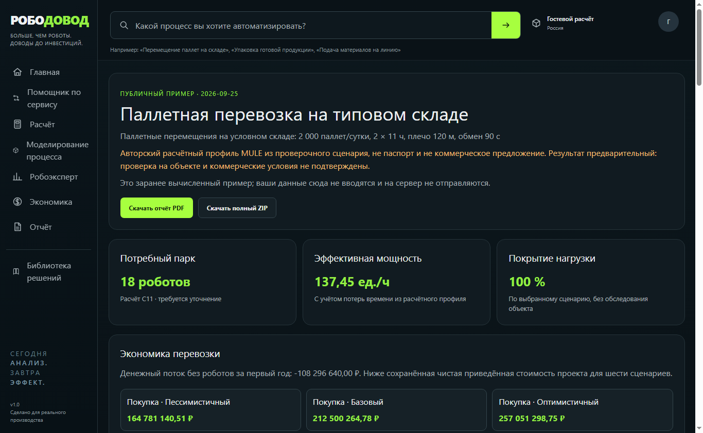
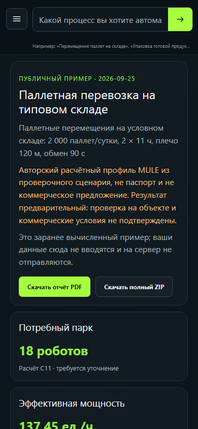
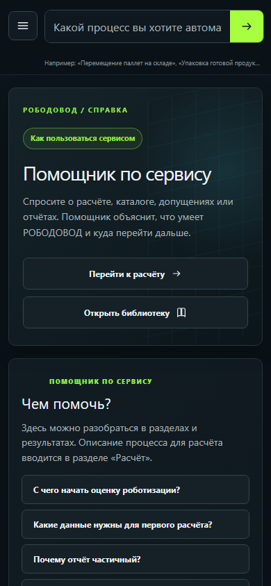
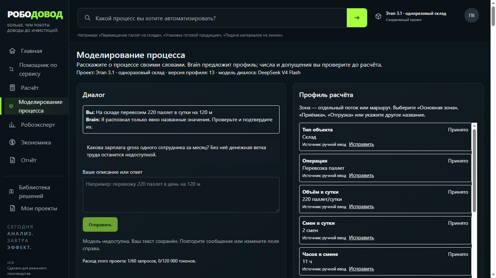
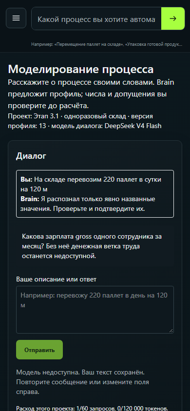
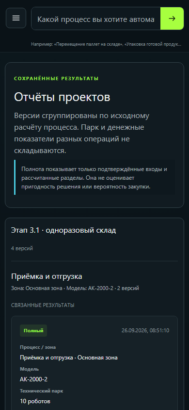

# РОБОДОВОД — руководство по новой версии

**Версия:** 26 сентября 2026 года. **Адрес после публикации:** [robodovod.ru](https://robodovod.ru). Сейчас это руководство проверено на локальной новой версии; опубликованный сайт может показывать предыдущий выпуск. [Руководство выпуска 25 сентября](USER_GUIDE_CURRENT_2026-09-25.md) сохранено отдельно.

Сервис помогает предварительно оценить роботизацию операции: потребный парк, денежные варианты и условное движение на схеме. **Результат не является проектом внедрения или предложением поставщика.** До решения о закупке нужно обследовать объект, проверить модель, интеграции и коммерческие условия.

## Выберите свой маршрут

- **Владелец бизнеса:** начните с публичного типового склада. За несколько минут увидите, как читать парк, шесть денежных сценариев и PDF. Затем поручите команде собрать собственные входы.
- **Руководитель проекта:** создайте проект, пройдите разговорное «Моделирование процесса», проверьте профиль, получите расчёт и сохраните версии. Для каждого варианта решения отдельно сверяйте допущения и источники.
- **Участник обследования:** измерьте объём и единицу работы, расстояние в одну сторону, график, число единиц за рейс, время обмена грузом, зоны и роль сотрудника. Неизвестные значения оставляйте неизвестными и передайте список недостающих подтверждений.

На компьютере разделы видны слева. На телефоне нажмите **«Открыть меню»** (кнопка с тремя полосками). Кнопка **Back** браузера возвращает к предыдущему разделу.

*Иллюстрация 1. Публичный пример в новой локальной версии; значения учебные.*

## Маршрут 1. Быстро посмотреть типовой склад

1. На **«Главной»** нажмите **«Попробовать демо»** или **«Открыть демо склада»**. Для этого входить не нужно.
2. Прочитайте верхний блок: пример описывает **2 000 паллет в сутки**, две смены по 11 часов, **120 м в одну сторону** и **90 секунд** на погрузку с выгрузкой. Это сценарные числа, а не данные вашего склада или паспорт робота.
3. Посмотрите **«Потребный парк»**, **«Эффективная мощность»** и **«Покрытие нагрузки»**. Ниже «Экономика перевозки» отдельно показывает покупку и аренду в пессимистичном, базовом и оптимистичном вариантах. Число NPV относится только к соответствующему варианту и его допущениям.
4. В **«Что входит в пример склада»** проверьте охват: учтена перевозка **подготовленных паллет** и труд водителя погрузчика. Отбор товара с полок и упаковка здесь не посчитаны.
5. Откройте сохранённую **«Схему работы и расчёт очереди»**, переключите **2D / 3D**. Посмотрите выполненную работу, очередь и загрузку. Геометрия условная; это объяснение расчёта, а не план помещения.
6. Раскройте **«Исходные допущения и источники»** и **«Ограничения примера»**. Скачайте **«Скачать отчёт PDF»** и **«Скачать полный ZIP»**. Демо заранее вычислено: его входы на сервер при просмотре не отправляются, и оно не создаёт ваш проект.
7. Нажмите **«Открыть ввод своего процесса и проект»**, когда готовы перейти к своим данным.

*Иллюстрация 2. На телефоне карточки идут друг под другом; меню открывается отдельной кнопкой.*

## Маршрут 2. Рассчитать свою операцию через разговорный профиль

### 1. Войдите и создайте проект

Нажмите круглый значок учётной записи вверху, выберите **«Регистрация»**, укажите почту и пароль, нажмите **«Создать аккаунт»**. Затем откройте **«Мои проекты»**, введите название и нажмите **«Создать»**. Если проект уже есть, откройте его кнопкой **«Открыть»**. Название активного проекта показано наверху экрана: новый расчёт сохранится в нём.

**«Помощник по сервису»** отвечает на вопросы о разделах, допущениях и отчётах. Например, спросите «Почему отчёт частичный?» или «Где скачать PDF?». Его ответ может предложить кнопку перехода. Помощник не составляет расчётный профиль и не ищет роботов в интернете: для разговора о вашей операции откройте **«Моделирование процесса»**.

*Иллюстрация 3. Справка доступна и без учётной записи.*

### 2. Расскажите о работе и проверьте профиль

В **«Моделировании процесса»** напишите обычными словами, например: «На складе перевозим 220 паллет в сутки на 120 м, работаем в две смены по 11 часов». Нажмите **«Отправить»**. Слева появится диалог и следующий вопрос, справа — **«Профиль расчёта»**.

Для паллетной перевозки проверьте как минимум: тип объекта и операцию, **паллет/сутки**, смены и часы, рабочие дни в году, **метры в одну сторону**, **паллет за один рейс**, время погрузки с выгрузкой и зону. «1 паллета за рейс» и «120 м» могут быть предложены как допущения: предложение само по себе ещё не подтверждение. Нажмите **«Исправить»** у неверного поля и **«Сохранить и подтвердить»** только после проверки. **«Принято»** означает введённое пользователем значение; **«Принятое допущение»** означает осознанно выбранное число для сценария.

**Зона** — отдельный поток или маршрут, например «Приёмка» и «Отгрузка». Если операции различаются по объёму или длине пути, опишите их отдельно. Их парки и NPV нельзя просто сложить: общие люди, зарядка и инфраструктура могут учитываться дважды.

Если AI-модель недоступна, ваш текст сохраняется, а значения можно исправить вручную в профиле. Отсутствие ответа модели не означает, что числа подтверждены.

*Иллюстрация 4. Учебная запись в локальной проверке: слева диалог, справа значения и их происхождение.*

*Иллюстрация 5. На узком экране профиль находится ниже диалога; прокрутите страницу до подтверждения.*

### 3. Получите парк и денежный результат

Нажмите **«Подтвердить профиль»**, затем в блоке **«Рассчитать и пересчитать»** выберите **«Модель из активного расчётного каталога»** и **«Рассчитать и сохранить»**. На экране появится технический результат: потребный парк, производительность, покрытие и ограничения. Выбор модели означает только возможность расчёта по имеющемуся профилю. Пригодность на вашем объекте проверяется отдельно.

После технического результата откроется **«Экономика: заполните то, что известно»**. Поля разделены на **«Труд»**, **«Покупка»**, **«RaaS»** (аренда) и **«Визуализация»**. Пустое поле означает **неизвестно**; `0` — проверенный ноль. Диапазон вроде `500000..800000` сохраняется как диапазон, но без точечного значения NPV этой ветки не считается. Для цены, зарплаты и других важных чисел выберите **«Данные пользователя»** или **«Допущение для сценария»** и проверьте источник.

Для типового складского профиля есть кнопки **«Предложить все числа»** и **«Подтвердить допущения»**. Между ними просмотрите каждое значение: предложенная цена и зарплата не становятся фактом вашего объекта. Внизу экономической формы отдельно отмечаются **пять условий для денежного расчёта**. Это подтверждения смысла сценария, а не договор с поставщиком. Укажите часовой пояс и модельное начало смены для 2D/3D.

- Если известных чисел пока мало, нажмите **«Сохранить частичный результат»**. В нём доступны уже рассчитанные разделы и список **«Что уточнить»**; неподтверждённые денежные ветки помечены **«не рассчитано»**. Откройте недостающие поля, проверьте их и сохраните **новый** полный результат.
- Когда входы и пять условий готовы, нажмите **«Полный расчёт»**. Прочитайте покупку и аренду отдельно, а внутри каждой — три варианта неопределённости. **NPV** — денежный итог за выбранный срок с приведением будущих сумм к дате оценки; он зависит от всех входных цен, зарплат и допущений. Проверьте статус, годовые расходы и чувствительность. Положительный NPV не подтверждает безопасность, цену поставщика или готовность к закупке.

**Пример отсутствующего NPV.** Вы ввели 220 паллет/сутки и 120 м, получили парк, но оставили цену покупки пустой и не подтвердили зарплату. Сервис сохраняет парк и частичный отчёт, а NPV покупки показывает «не рассчитано». Сначала узнайте цену с составом поставки, проверьте зарплату до удержаний и условия соответствующих веток. Затем создайте новый полный расчёт. Не подставляйте случайную цену ради появления числа.

Если удобнее заполнять форму по пунктам, используйте раздел **«Расчёт»**. В складском профиле проверьте поле **«Единиц/рейс»**: для примера одна подготовленная паллета за рейс, но для вашей техники значение может быть другим. После изменения объёма или зоны проверяйте это поле снова.

### 4. Посмотрите схему, сравните варианты и сохранённые версии

Из технического результата нажмите **«Открыть 2D/3D и полный технический результат»**; в полном экономическом результате есть переход **«К 2D и 3D»**. Схема и отчёт симуляции относятся к сохранённому сценарию. В 2D видны зоны, этапы, очереди и узкое место. В 3D показана паллетная перевозка; для отбора, буфера и упаковки подтверждённой 3D-модели нет. Движение на экране не задаёт денежные формулы.

Для пересчёта используйте **«Исправить»**, **«Подтвердить профиль»**, затем **«Пересчитать как новый run»** или **«Новая версия»** в истории. Слово `run` на кнопке означает отдельный сохранённый расчёт. Старый результат остаётся отдельной версией. Для вопроса «что если расстояние станет больше?» создайте новую версию профиля и расчёт, затем сравните одинаковые показатели двух версий.

Раздел **«Робоэксперт»** сравнивает две или три позиции **одного расчётного класса** по известным данным каталога, пропускам и источникам. Нажмите **«Сравнить выбранные»**; для сохранённой операции можно посмотреть рейтинг. **«Информационные решения каталога»** видны отдельно: у них может не быть проверенной формулы или входов для парка и NPV. **«Составить пояснение»** и **«Проверить свежие сведения»** используют внешние сервисы по отдельному действию; результат поиска требует проверки и не меняет официальный расчёт. Если сервисы недоступны, сравнение по каталогу остаётся.

Раздел **«Экономика»** объясняет формулы и входы. В строке поиска попробуйте «окупаемость», «NPV» или «цена владения», откройте карточку термина и посмотрите, какие поля нужны. Примеры в справочнике не являются числами вашего проекта.

В **«Отчёты»** результаты сгруппированы по проекту и операции. Карточка сообщает **«Частичный»** или **«Полный»**, рассчитанные разделы, число подтверждённых входов и NPV только там, где он получен. Кнопки **«Открыть»**, **«PDF»**, **«ZIP»** и **«Новая версия»** относятся к выбранной карточке. Отметьте две версии одной операции флажком **«Сравнить»**, чтобы увидеть их рядом. Сохранённый результат можно открыть повторно вместе с 2D/3D; просмотр и скачивание не пересчитывают старые числа.

*Иллюстрация 6. История локального тестового проекта: метка полноты видна до открытия отчёта.*

## Как читать PDF и ZIP

**PDF** — основной документ для чтения: найдите операцию, зону, модель, объём, парк, статусы проверки, покупку и аренду, допущения и список недостающих данных. У частичного результата денежные разделы могут содержать «не рассчитано»; это точное состояние результата, а не ошибка файла.

**ZIP** — архив для проверки расчёта и передачи специалистам. Начните с файла **«НАЧНИТЕ_ЗДЕСЬ.md»**. Внутри также лежат PDF, исходные снимки и машинный `manifest.json` с контрольными суммами. Перед сравнением двух архивов проверьте, что они относятся к нужным проекту, операции, версии и дате. Не пересылайте ZIP с конфиденциальными зарплатами или ценами без согласования.

Числа в сохранённом PDF и ZIP привязаны к версии расчёта. Если вы изменили поле на экране, скачайте экспорт **новой** версии; старый документ остаётся свидетельством старых входов.

## Статусы и границы оценки

| Надпись | Что означает | Что делать |
| --- | --- | --- |
| **Принято** | Пользователь подтвердил значение в профиле. | Сверить с замером или документом. |
| **Принятое допущение** | Пользователь разрешил использовать предположение для сценария. | Заменить измерением или предложением поставщика перед решением. |
| **Нужно подтвердить / уточнить** | Значение предложено или отсутствует. | Проверить единицу, число и источник. |
| **Частичный / не рассчитано** | Часть разделов сохранена, для других не хватает данных. | Открыть «Что уточнить» и создать новую версию. |
| **Полный** | Для предусмотренных веток достаточно входов и подтверждений. | Проверить пригодность и коммерческие условия отдельно. |
| **Требует проверки** | Данные каталога или внешнего поиска не подтверждены для объекта. | Запросить паспорт, демонстрацию и письменные условия. |
| **Информационная позиция** | Карточка есть, но поддержанной формулы/фактов для парка или NPV нет. | Использовать как предмет исследования, без вымышленного расчёта. |

**Паллетная перевозка** начинается с уже подготовленной паллеты и заканчивается её доставкой. **Отбор** собирает товарные позиции до формирования паллеты; единицей могут быть строки заказа или коробки. **Упаковка** готовит отобранный товар к отправке. Это разные операции с разными объёмами и ролями. В «Складской цепочке и охвате» можно описать их связь и увидеть узкое место, если входы поддержаны; денежный эффект перевозки сам по себе не покрывает труд отбора и упаковки.

Перед закупкой проверьте измеренные объёмы и пики, маршрут и ширину проходов, безопасность и интеграции, доступность модели, подтверждённые цену и состав поставки, обслуживание, батареи, инфраструктуру, условия аренды и распределение общих затрат. Используйте результат для постановки вопросов поставщику и обследованию, а не как автоматическое решение о покупке.
