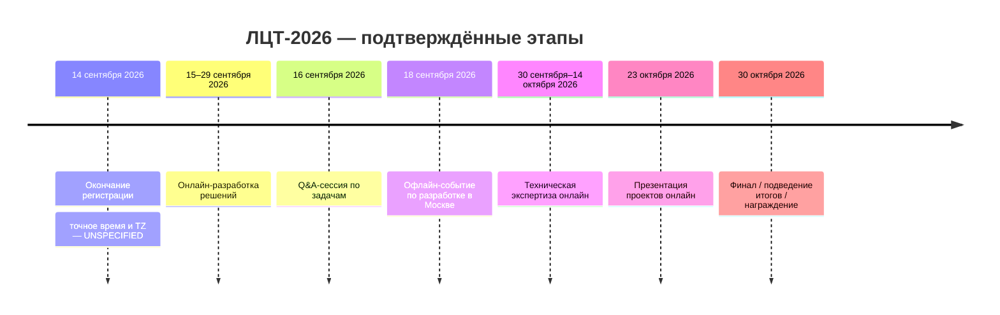

# ЛЦТ‑2026: полный аудит официальных материалов по кейсу роботизации

## Executive summary

Поскольку в запросе не был указан номер кейса или его название, в качестве **выбранного кейса роботизации** принят кейс, который на официальной странице ЛЦТ‑2026 прямо называется:

> **«Платформа подбора роботизированных решений с расчётом экономического эффекта и визуализацией работы роботов на объекте»**. citeturn8search1turn32search0

Официальная карточка относит его к направлению **«01. Логистика»** и указывает ДПИИР; официальный материал Правительства Москвы уточняет, что задачу предложили **Департамент предпринимательства и инновационного развития города Москвы совместно с Федеральным центром беспилотных авиационных систем**. citeturn8search1turn7search3 Официальные ресурсы ФЦ БАС подтверждают полное наименование организации — **АНО «Федеральный центр беспилотных авиационных систем»**. citeturn23search5turn23search8

По состоянию на **9 сентября 2026 года по Asia/Tokyo** удалось документально подтвердить функциональное ядро задачи: пользователь задаёт отрасль и тип объекта; сервис должен помогать подбирать варианты роботизации, сопоставлять их, рассчитывать экономический эффект/показатели эффективности и визуализировать предполагаемую эксплуатацию роботов на объекте. В качестве примеров объектов в официальном городском описании приводятся склад, аэропорт и медицинская клиника. citeturn5search0turn6search0

Одновременно существенная часть того, что обычно составляет детальное ТЗ хакатона, **в открытых официальных материалах на контрольную дату не опубликована либо не доступна в индексируемом виде**: точные критерии оценки и их веса; task-specific dataset/API и лицензии; технический стек и вычислительные лимиты; форматы загружаемых планов/данных; конкретная формула экономического эффекта; требования к 2D/3D/симуляции; обязательность ИИ; submission-файлы, репозиторий, видео и Docker; продолжительность защиты; положения о передаче исключительных прав на код; точное время и часовой пояс дедлайна регистрации. Эти пункты ниже помечены **UNSPECIFIED**, без реконструкции по прошлым сезонам.

| Область | Что установлено на 09.09.2026 | Статус |
|---|---|---|
| Название | Полное точное название подтверждено официальной страницей | **CONFIRMED** |
| Заказчик | ДПИИР; совместный постановщик/экспертный партнёр — ФЦ БАС | **CONFIRMED** |
| Problem statement | Подбор роботизации + экономика + визуализация эксплуатации | **CONFIRMED** |
| Target user | Заказчик, выбирающий роботизацию объекта | **CONFIRMED / роли детально не определены** |
| Mandatory functional core | Подбор, сравнение, экономическая оценка, визуализация | **CONFIRMED** |
| Input/output semantics | Отрасль/тип объекта → варианты/эффект/сценарий | **CONFIRMED** |
| Форматы input/output | JSON/CSV/CAD/BIM и т. п. | **UNSPECIFIED** |
| Dataset/API | Task-specific набор данных/API | **UNSPECIFIED** |
| Критерии и веса | Известно лишь, что оценивание идёт по заранее заданным критериям | **UNSPECIFIED по названиям и весам** |
| Technical restrictions | Языки, ОС, cloud, GPU/CPU, network | **UNSPECIFIED** |
| Submission package | Файлы, Git, image/container, видео | **UNSPECIFIED** |
| Защита | 23.10.2026, онлайн | **CONFIRMED; длительность UNSPECIFIED** |
| Visualization | Работа роботов на объекте/сценарий эксплуатации | **CONFIRMED** |
| AI/ML | Обязательность модели ИИ | **UNSPECIFIED; публично не требуется** |
| IP на решение | Передача/сохранение исключительных прав | **UNSPECIFIED** |
| Основные даты | 14.09, 15–29.09, 30.09–14.10, 23.10, 30.10 | **CONFIRMED** |
| Точное время дедлайнов/TZ | В основном расписании не указаны | **UNSPECIFIED** |

Критически важно учитывать временную границу исследования. **Q&A по задачам назначена только на 16 сентября 2026 года**, то есть на контрольную дату она ещё не состоялась; следовательно, возможные будущие уточнения заказчика, ответы на вопросы команд и task-specific изменения сейчас физически не могут входить в полный архив сезона. citeturn18view0turn28view0

Единственная уже опубликованная общая подробная видеосессия — **«Лидеры цифровой трансформации: Марафон вызовов» от 27 августа 2026 года**. Официальный канал прямо говорит, что в записи представители постановщиков раскрывают детали задач, нюансы и ожидаемый результат. Запись имеет продолжительность **2:49:35**. citeturn28view0turn21search0turn21search4 Однако публично индексируемая версия VK Video не даёт транскрипта или chapter marks, позволяющих без догадки установить начало и конец именно роботизационного блока. Поэтому **точный timestamp кейса = UNSPECIFIED**, а не приблизительная оценка.

## Идентификация кейса и карта первоисточников

### Точное название и заказчик

Официальное название воспроизводится без нормализации:

> **«Платформа подбора роботизированных решений с расчётом экономического эффекта и визуализацией работы роботов на объекте»**. citeturn8search1turn33search5

На индексируемой части официальной страницы рядом с задачей отображается **«ДПИИР (Департамент …)»** и категория «01. Логистика». citeturn8search1 Полное наименование ведомства — **Департамент предпринимательства и инновационного развития города Москвы** — подтверждается официальными материалами Правительства Москвы и официальным приказом о ЛЦТ‑2026. citeturn37search0turn7search3

При этом официальный Mos.ru формулирует постановку шире: ДПИИР **совместно с Федеральным центром беспилотных авиационных систем** предложил участникам создать платформу подбора роботизированных решений. citeturn7search3 Поэтому наиболее точная, не смешивающая роли фиксация выглядит так:

| Роль | Организация | Основание |
|---|---|---|
| Заказчик/городской постановщик, отображаемый в карточке | **Департамент предпринимательства и инновационного развития города Москвы (ДПИИР)** | Официальная карточка ЛЦТ citeturn8search1 |
| Совместный постановщик / профильный партнёр | **АНО «Федеральный центр беспилотных авиационных систем» (ФЦ БАС)** | Mos.ru + официальные ресурсы ФЦ БАС citeturn7search3turn23search8 |
| Оператор конкурса в нормативной базе | **АНО «Развитие человеческого капитала»** | Приказ ДПиИР № П‑18‑12‑100/26; правовой обзор документа citeturn37search0turn40search0 |
| Учредитель премий | **Правительство Москвы** | Нормативная база конкурса citeturn37search24turn40search0 |

Называть только ФЦ БАС «заказчиком» было бы неточно; столь же неточно было бы игнорировать ФЦ БАС и считать, что постановка сформирована исключительно ДПИИР.

### Реестр основных официальных материалов

| Материал | Значение для кейса | Ссылка |
|---|---|---|
| Официальная страница ЛЦТ‑2026 | Название задачи, список кейсов, общая механика конкурса, документы | [i.moscow/lct](https://i.moscow/lct) citeturn32search0turn34search3 |
| Официальная публикация Правительства Москвы о задачах | Постановщики и функциональный смысл роботизационной платформы | [Mos.ru — материал о задачах ЛЦТ‑2026](https://www.mos.ru/news/item/173576073/) citeturn6search0turn7search3 |
| Официальный городской бизнес-портал | Расширенное описание пользовательского сценария и результата | [Delo.mos.ru](https://delo.mos.ru/news/a9aa7e0fb8c54ce185a692cb4afd52e3) citeturn5search0 |
| Официальный Telegram ЛЦТ | Марафон вызовов, Q&A, этапы, призы, организационные объявления | [Telegram «Лидеры цифровой трансформации»](https://t.me/s/leaders_hack) citeturn18view0turn28view0 |
| «Марафон вызовов», 27.08.2026 | Представители постановщиков объясняют задачи и ожидаемый результат | [VK Video, запись марафона](https://vkvideo.ru/video-185263155_456239314) citeturn21search4turn21search0 |
| Официальная страница ФЦ БАС | Подтверждение организации-партнёра и профиля | [i.moscow/bas](https://i.moscow/bas) citeturn23search5 |
| Приказ ДПиИР от 20.05.2026 № П‑18‑12‑100/26 | Нормативная основа конкурса на премии Мэра Москвы | [Mos.ru — официальный документ](https://www.mos.ru/dpir/documents/prikazy-i-rasporiazheniia-departamenta/view/343029220/) citeturn37search0 |
| Соглашение о пользовании i.moscow | Общие юридические условия использования платформы, не task-specific IP | [i.moscow — соглашение](https://i.moscow/soglashenie-o-polzovanii) citeturn34search11 |

На официальной странице ЛЦТ также индексируются документы с названиями **«Положение о проведении соревнования (Бизнес)»**, **«Положение о проведении конкурса (Город)»**, документ об изменениях в приказ АНО «Развитие человеческого капитала» от 21.05.2026 № ОД‑150/26, политика обработки персональных данных и согласия. citeturn34search3turn36search0turn37search1

Важное ограничение источников: непосредственное открытие ряда страниц i.moscow и Mos.ru из исследовательской среды возвращало HTTP 403, хотя поисковый индекс раскрывает официальные заголовки и фрагменты. citeturn35view0turn38view0 Это особенно существенно для документов, текст которых может быть динамически встроен в карточку. Поэтому сведения, не видимые в официальной индексации и не подтверждённые другими официальными каналами, ниже **не реконструируются**.

Отдельного открыто индексируемого **PDF/TЗ именно данного роботизационного кейса**, отдельного task-specific FAQ или отдельной страницы `/hackatons/<id>/...` для него обнаружить не удалось: запросы по полному названию, словосочетаниям «API», «датасет», «функционал», «критерии» и по связке ДПИИР/ФЦ БАС возвращали основную страницу ЛЦТ, а не детальную карточку. Это принципиально отличает настоящий кейс от ряда архивных задач ЛЦТ, для которых поисковик действительно индексирует отдельные deep-link карточки. citeturn45search1turn45search4turn45search9

## Постановка задачи, пользователи и обязательный функционал

### Problem statement

Наиболее формальная публичная формулировка содержится уже в названии кейса: требуется **платформа подбора роботизированных решений**, которая одновременно связывает подбор с **расчётом экономического эффекта** и **визуализацией работы роботов непосредственно применительно к объекту**. citeturn8search1

Официальный городской материал конкретизирует ожидаемое поведение сервиса:

> «Система подберет оптимальные варианты роботизации, рассчитает показатели эффективности и покажет предполагаемый сценарий эксплуатации». citeturn6search0

Таким образом, задача не сводится к каталогу роботов. В опубликованной постановке присутствуют три связанных слоя: **decision support → economics → operational visualization**. Просто каталог с фильтрами закрывает лишь первый слой и то частично.

Официальный материал также описывает пользовательский ввод:

> «Пользователь сможет указать отрасль и тип объекта…» citeturn5search0

В качестве иллюстративных объектов в этом же официальном описании фигурируют **склад, аэропорт и медицинская клиника**. citeturn5search0 Это важный сигнал: платформа задумана не как конфигуратор единственного складского робота, а как сервис, способный работать хотя бы концептуально с неоднородными объектами и сценариями применения.

### Target users

**Подтверждённый target user — заказчик роботизации**, то есть пользователь, которому необходимо выбрать технологию/решение для автоматизации конкретного объекта. Официальное описание ставит сервис именно в контекст помощи заказчикам в выборе роботизированных технологий и экономической оценке такого выбора. citeturn5search0turn6search0

Более подробное деление ролей — например, «директор по логистике», «инженер по автоматизации», «главный технолог», «интегратор», «финансовый директор», «оператор объекта» — в доступных материалах **не установлено**:

**Target roles beyond “заказчик/пользователь, выбирающий роботизацию”: `UNSPECIFIED`.**

Для RobCo допустимо проектировать несколько personas, но нельзя выдавать их за требование заказчика.

### Mandatory functions

По совокупности официального названия и городского описания получается следующий минимальный функциональный контракт.

| Функция | Степень подтверждения | Что должно быть доказуемо в демо |
|---|---|---|
| Принять контекст задачи роботизации | **CONFIRMED** | Пользователь задаёт как минимум отрасль и тип объекта citeturn5search0 |
| Подобрать подходящие роботизированные решения | **CONFIRMED** | На входном контексте получается релевантный набор/вариант роботизации citeturn6search0turn8search1 |
| Сопоставить варианты | **CONFIRMED как пользовательская цель** | Заказчик способен осмысленно выбрать между альтернативами citeturn5search0 |
| Рассчитать экономический эффект | **CONFIRMED** | Есть численно выраженная экономика решения citeturn8search1turn6search0 |
| Рассчитать показатели эффективности | **CONFIRMED** | Система выдаёт показатели эффективности, а не только описание робота citeturn6search0 |
| Визуализировать работу роботов на объекте | **CONFIRMED** | Видно, как выбранное решение предполагается использовать на конкретном объекте citeturn8search1 |
| Показать предполагаемый сценарий эксплуатации | **CONFIRMED** | Визуализация связана с операционным сценарием, а не является декоративным 3D-рендером citeturn6search0 |

Особенно важна связка последних двух требований. Публичная постановка требует не просто красивого изображения робота, а **визуализации того, как он работает/эксплуатируется на объекте**. citeturn8search1turn6search0

### Required input/output

Подтверждённый контракт существенно менее детален, чем полноценная спецификация API.

| Сторона | Подтверждённое содержание | Формат |
|---|---|---|
| Input | Отрасль | **Формат UNSPECIFIED** |
| Input | Тип объекта | **Формат UNSPECIFIED** |
| Input | Дополнительные параметры объекта/процесса | **UNSPECIFIED** |
| Input | План помещения/территории | **UNSPECIFIED** |
| Input | CAD/BIM/IFC/DWG/DXF | **UNSPECIFIED** |
| Input | Фото/видео/лидар/карта | **UNSPECIFIED** |
| Output | Подходящие/оптимальные варианты роботизации | **CONFIRMED; сериализация UNSPECIFIED** |
| Output | Сравнение альтернатив | **Смысл подтверждён; конкретная таблица/метрика UNSPECIFIED** |
| Output | Экономический эффект/показатели эффективности | **CONFIRMED; формулы UNSPECIFIED** |
| Output | Предполагаемый сценарий эксплуатации | **CONFIRMED; формат UNSPECIFIED** |
| Output | Визуализация работы роботов на объекте | **CONFIRMED; 2D/3D/VR UNSPECIFIED** |

То есть нет документального основания утверждать, что заказчик требует, например, загрузку IFC, CAD-плана, GeoJSON или ROS bag. Аналогично нельзя считать обязательным экспорт PDF/Excel/JSON, пока это не будет сообщено отдельно.

## Данные, технические ограничения, визуализация и ИИ

### Datasets, API и ограничения данных

В обнаруженных открытых материалах **не опубликованы** task-specific:

**dataset; API endpoint; swagger/openAPI; CSV/XLSX/JSON-файл с роботами; справочник характеристик; прайс-лист; тестовый набор объектов; train/test split; лицензия на данные; правила использования внешних источников; периодичность обновления.**

Все эти позиции имеют статус **`UNSPECIFIED`**. Поиски по официальному домену i.moscow с полным названием кейса и терминами «API», «данные», «датасет» не вывели отдельного материала по данной задаче. citeturn45search0

При этом у Москвы существует более широкий официальный контекст по цифровизации и роботизации предприятий: городские материалы сообщают о базе с сотнями решений/инструментов и о работе с поставщиками и интеграторами. citeturn5search12 **Но официального утверждения, что именно эта база является dataset ЛЦТ‑2026, нет.** Использовать её как потенциальный источник можно только после проверки условий доступа и лицензии; считать её выданным организаторами датасетом нельзя.

Это создаёт один из крупнейших проектных рисков: без нормализованной базы роботизированных решений невозможно объективно показать «подбор», а без информации о стоимости внедрения, производительности, инфраструктурных требованиях и OPEX трудно обосновать экономику.

Практически для каждой карточки робота RobCo понадобится как минимум provenance данных: источник, дата актуальности, единицы измерения, производительность, эксплуатационные ограничения и происхождение цены. Но это **рекомендация по обеспечению доказуемости решения**, а не опубликованное правило ЛЦТ.

### Формула экономического эффекта

Официальные материалы требуют расчёта экономического эффекта и показателей эффективности, но **не определяют саму модель расчёта**. citeturn8search1turn6search0

Следовательно:

| Показатель | Статус требования |
|---|---|
| CAPEX | `UNSPECIFIED` |
| OPEX | `UNSPECIFIED` |
| TCO | `UNSPECIFIED` |
| ROI | `UNSPECIFIED` |
| Payback Period | `UNSPECIFIED` |
| NPV | `UNSPECIFIED` |
| IRR | `UNSPECIFIED` |
| Ставка дисконтирования | `UNSPECIFIED` |
| Горизонт расчёта | `UNSPECIFIED` |
| Стоимость человеческого труда | `UNSPECIFIED` |
| Утилизация/амортизация | `UNSPECIFIED` |
| Стоимость интеграции и инфраструктуры | `UNSPECIFIED` |
| Эффект от повышения throughput | `UNSPECIFIED` |
| Эффект от снижения ошибок/брака | `UNSPECIFIED` |

Для RobCo отсюда следует важный принцип: экономический модуль должен показывать **исходные предпосылки расчёта**, иначе любой ROI можно получить подбором скрытых параметров. Это особенно важно именно потому, что официальная формула пока не задана.

### Technical restrictions

Из открытых task-specific материалов **не удалось подтвердить никаких обязательных ограничений** по:

языку программирования; frontend/backend framework; операционной системе; базе данных; обязательному облаку; Docker/Kubernetes; российскому ПО; ROS/ROS2; Gazebo/Isaac Sim; видеокарте; CPU/RAM; времени inference; объёму модели; доступу в интернет; использованию SaaS/API третьих сторон; размещению данных; требованиям ФСТЭК/ФСБ; авторизации/ролям; шифрованию; нагрузке.

Все эти позиции: **`UNSPECIFIED`**.

Сам конкурс и этап разработки проводятся онлайн, причём официальные городские материалы подчёркивают возможность участия из разных городов и стран. citeturn23search19 Из этого **нельзя** делать вывод, что разрешён любой внешний SaaS или любая модель/API: условия использования сторонних сервисов необходимо уточнять отдельно.

### Visualization requirements

Здесь требование, наоборот, однозначное: визуализация входит прямо в название кейса — **«визуализацией работы роботов на объекте»**. citeturn8search1 Официальное описание связывает её с «предполагаемым сценарием эксплуатации». citeturn6search0

Но уровень визуального моделирования не задан:

| Вопрос | Официальный статус |
|---|---|
| Достаточно ли 2D-плана | `UNSPECIFIED` |
| Обязателен ли 3D | `UNSPECIFIED` |
| Нужна ли физическая симуляция движения | `UNSPECIFIED` |
| Collision detection | `UNSPECIFIED` |
| Временная симуляция throughput | `UNSPECIFIED` |
| Digital twin | `UNSPECIFIED` |
| VR/AR | `UNSPECIFIED` |
| Импорт BIM/IFC | `UNSPECIFIED` |
| Импорт CAD | `UNSPECIFIED` |
| Реальный ROS/robot controller | `UNSPECIFIED` |
| Фотореализм | `UNSPECIFIED` |

Поэтому наиболее безопасное чтение требований — **визуализация должна объяснять эксплуатационный сценарий и размещение/поведение выбранного робота**, а не обязательно быть дорогим физически точным цифровым двойником.

### AI и explainability

В публичном названии и доступной официальной постановке **нет требования использовать искусственный интеллект, ML, LLM, CV или конкретную модель**. citeturn8search1turn6search0

Таким образом:

**обязательное применение AI = `UNSPECIFIED`; обязательная explainability AI = `UNSPECIFIED`.**

Строго по опубликованному тексту подбор может быть реализован и как правила/constraint engine/multi-criteria recommender, если он качественно решает задачу. Это аналитический вывод из отсутствия AI-условия в опубликованной постановке, а не гарантия того, что ИИ не появится в будущих критериях или Q&A.

Для RobCo объяснимость решения всё же имеет практическую ценность: показывать, **почему** робот подходит объекту, какие ограничения отфильтровали остальные варианты и из каких предпосылок рассчитана экономика. Но называть explainability отдельным критерием ЛЦТ‑2026 сейчас нельзя.

## Оценивание, подача, защита и правовые условия

### Evaluation criteria и веса

Это крупнейший неразрешённый информационный gap.

Официальная страница сообщает, что отбор производится на платформе посредством выставления командам оценок **по заранее заданным критериям**, и что далее проходят **по 10 команд на задачу**. citeturn13search0

Однако в доступной открытой индексации ЛЦТ‑2026 **не обнаружены названия этих критериев, шкалы и числовые веса**. Поиски по комбинациям «критерии оценки», «функциональность», «вес», «30%», «20%», «10%» с ограничением на официальный домен не дали task-specific результатов. Поэтому:

> **Evaluation criteria wording: `UNSPECIFIED`.**  
> **Numerical weights: `UNSPECIFIED`.**

Нельзя переносить веса ЛЦТ‑2024/2025 или другого хакатона на 2026 год: пользователь отдельно потребовал отсутствие догадок, и это было бы методологически неверно.

| Элемент оценивания | Подтверждение |
|---|---|
| Оценивание по критериям | **Да** citeturn13search0 |
| Критерии определены заранее | **Да** citeturn13search0 |
| Названия критериев | **UNSPECIFIED** |
| Шкала оценки | **UNSPECIFIED** |
| Веса | **UNSPECIFIED** |
| Порог прохождения | **UNSPECIFIED** |
| Число проходящих команд | **10 на задачу** citeturn13search0 |
| Tie-break | **UNSPECIFIED** |
| Автоматические метрики | **UNSPECIFIED** |
| Ручная экспертная оценка | Факт выставления оценок подтверждён; состав/методика **UNSPECIFIED** |

Отсутствие весов означает, что сейчас нельзя строго доказать, например, что 3D-визуализация ценнее экономического калькулятора или наоборот. Приоритизация RobCo до публикации критериев должна опираться прежде всего на явно обязательный functional core.

### Submission, demo и defense

Официально подтверждены две стадии после разработки:

**30 сентября — 14 октября 2026 года: техническая экспертиза онлайн; 23 октября 2026 года: презентация проектов онлайн.** citeturn18view0turn28view0

Но публичные материалы на контрольную дату не дают детального submission contract:

| Параметр | Статус |
|---|---|
| Git-репозиторий | `UNSPECIFIED` |
| GitHub/GitLab/SourceCraft | `UNSPECIFIED` |
| Архив исходников | `UNSPECIFIED` |
| Docker image / docker-compose | `UNSPECIFIED` |
| Развёрнутый URL | `UNSPECIFIED` |
| README | `UNSPECIFIED` |
| Architecture document | `UNSPECIFIED` |
| Презентация PDF/PPTX | `UNSPECIFIED` |
| Формат/шаблон презентации | `UNSPECIFIED` |
| Demo video | `UNSPECIFIED` |
| Длительность видео | `UNSPECIFIED` |
| Live demo | `UNSPECIFIED` |
| Длительность pitch | `UNSPECIFIED` |
| Время Q&A с жюри | `UNSPECIFIED` |
| Обязательный доступ экспертов к сервису | `UNSPECIFIED` |

Поэтому делать сейчас дорогостоящую «идеальную» упаковку submission под предполагаемый формат рискованно. Критически важнее иметь воспроизводимый работающий прототип, который впоследствии можно быстро упаковать в объявленный формат.

### Legal/IP

Официальная нормативная основа городского конкурса — **приказ Департамента предпринимательства и инновационного развития города Москвы от 20 мая 2026 года № П‑18‑12‑100/26 «О конкурсе на соискание премий Мэра Москвы “Лидеры цифровой трансформации” в 2026 году»**. citeturn37search0 Официальная страница ЛЦТ одновременно перечисляет положение о конкурсе для городских задач, положение о соревновании для бизнеса и документы АНО «Развитие человеческого капитала». citeturn34search3turn36search0

Правовые обзоры нормативного акта подтверждают, что конкурс является публичным и открытым, участие осуществляется безвозмездно, а оператором выступает АНО «Развитие человеческого капитала». citeturn40search0turn40search1 Эти источники полезны для проверки официального акта, но являются вторичными по отношению к Mos.ru.

Ключевой для RobCo вопрос — **кто владеет кодом и иными результатами интеллектуальной деятельности после участия** — из доступных официальных индексируемых фрагментов не устанавливается.

Следовательно:

| IP-вопрос | Вывод |
|---|---|
| Исключительные права на исходный код остаются у команды | **UNSPECIFIED — не подтверждено** |
| Исключительные права автоматически передаются заказчику | **UNSPECIFIED — не подтверждено** |
| Организатор получает простую лицензию | **UNSPECIFIED** |
| Заказчик получает право дальнейшего использования | **UNSPECIFIED** |
| Обязательная open-source публикация | **UNSPECIFIED** |
| Разрешён закрытый код | **UNSPECIFIED** |
| Разрешены коммерческие библиотеки/API | **UNSPECIFIED** |
| Требуется раскрыть лицензии dependencies | **UNSPECIFIED** |
| Права на загружаемые организатором данные | **UNSPECIFIED task-specifically** |
| Право команды публиковать решение после конкурса | **UNSPECIFIED** |

Общее [Соглашение о пользовании i.moscow](https://i.moscow/soglashenie-o-polzovanii) существует, но его нельзя автоматически трактовать как договор об отчуждении прав на конкурсное ПО. citeturn34search11 До получения конкретного пункта положения/соглашения **RobCo не следует исходить ни из сохранения, ни из передачи IP**.

### Призы

Официальный канал ЛЦТ указывает призовую структуру по каждой задаче:

**1-е место — 1 000 000 рублей; 2-е — 600 000; 3-е — 400 000 рублей.** citeturn28view0 В сумме по 20 задачам это соответствует заявленному общему призовому фонду 40 млн рублей. Официальные материалы также подтверждают, что в 2026 году участникам предложено 20 задач. citeturn15search6turn33search5

## Сроки и timeline

Официальный Telegram ЛЦТ даёт наиболее подробное на текущую дату расписание. Регистрация продолжается до 14 сентября; далее следует онлайн-разработка 15–29 сентября, Q&A по задачам 16 сентября, офлайн-мероприятие по разработке в Москве 18 сентября, техническая экспертиза 30 сентября–14 октября, онлайн-презентация 23 октября и финал 30 октября. citeturn18view0turn28view0

### Таблица дедлайнов

| Событие | Точная дата | Формат | Время | Часовой пояс | Источник |
|---|---:|---|---|---|---|
| Окончание регистрации | **14.09.2026** | Онлайн | `UNSPECIFIED` официально | `UNSPECIFIED` | citeturn18view0turn28view0 |
| Разработка | **15–29.09.2026** | Онлайн | — | — | citeturn18view0 |
| Q&A по задачам | **16.09.2026** | `UNSPECIFIED` в извлечённом фрагменте | `UNSPECIFIED` | `UNSPECIFIED` | citeturn18view0 |
| Событие по разработке | **18.09.2026** | Офлайн, Москва | `UNSPECIFIED` | `UNSPECIFIED` | citeturn18view0 |
| Техническая экспертиза | **30.09–14.10.2026** | Онлайн | — | — | citeturn18view0turn28view0 |
| Презентация проектов | **23.10.2026** | Онлайн | `UNSPECIFIED` | `UNSPECIFIED` | citeturn18view0 |
| Финал/награждение | **30.10.2026** | Москва / финальное мероприятие | `UNSPECIFIED` | `UNSPECIFIED` | citeturn18view0turn33search0 |

В индексируемом тексте официальной страницы также появляется начало пункта **«16 октября 2026 года: …»**, однако продолжение названия этапа поисковым индексом обрезано. citeturn13search0 Без полного текста невозможно достоверно установить, означает ли это публикацию результатов технической экспертизы, объявление финалистов или иное действие. Поэтому **16.10.2026 не включено выше как идентифицированный hard deadline**.

Отдельно о времени закрытия регистрации: вторичный городской агрегатор ICT.Moscow указывает **23:59**, однако в доступном фрагменте нет явной маркировки часового пояса. citeturn12search5 Другой агрегатор формирует календарное событие в `Europe/Moscow`, но это не является достаточным доказательством того, что именно конкурсный cutoff установлен в 23:59 MSK. citeturn33search0 Поэтому официальный статус остаётся:

> **Registration cutoff time = `UNSPECIFIED`; timezone = `UNSPECIFIED`.**

### Вебинары и временные метки

Официальный канал анонсировал на **27 августа 2026 года, 14:00** мероприятие «Лидеры цифровой трансформации: марафон вызовов». В анонсе прямо сказано, что представители городских и бизнес-задач должны рассказать о проблематике, специфике и о том, на что обратить внимание. После эфира официальный канал опубликовал запись и указал, что в ней содержатся подробности каждой задачи, нюансы и ожидаемый результат. citeturn28view0

| Запись | Дата | Длительность | Timestamp роботизационного кейса |
|---|---|---:|---|
| [«Лидеры цифровой трансформации: Марафон вызовов»](https://vkvideo.ru/video-185263155_456239314) | **27.08.2026** | **2:49:35** | **`UNSPECIFIED` — публичная индексация не раскрывает chapters/transcript** citeturn21search0turn21search4 |
| Q&A по задачам | **16.09.2026** | Ещё не состоялась на контрольную дату | **Не существует на 09.09.2026** citeturn18view0 |

Давать приблизительный timestamp роботизационного блока по порядку задач или делением длительности ролика на количество кейсов было бы именно той догадкой, которую пользователь просил исключить.

## Вторичные источники и границы полноты

### Вторичные и медиа-источники

Официальные материалы имеют приоритет. Вторичные ресурсы использованы только для cross-check или выявления деталей, которые затем не повышались до уровня обязательного требования без официального подтверждения.

**ICT2GO** публикует полный список задач, условия «команда от 2 до 5 человек» и основные этапы: регистрация до 14 сентября, разработка 15–29 сентября, экспертиза 30 сентября–14 октября, презентация 23 октября, церемония 30 октября. Это хорошо согласуется с официальным каналом, но остаётся вторичным источником. citeturn33search0

**ICT.Moscow** указывает для окончания приёма заявок 14 сентября и в индексируемом материале фигурирует `23:59`. Поскольку часовой пояс там не дан однозначно применительно к cutoff, в основном отчёте время не принято за официальное. citeturn33search6turn12search5

**Rambler** перепечатывает/пересказывает московский материал и содержит более развёрнутую формулировку пользовательского сценария: выбор технологий для автоматизации объекта, сравнение вариантов, экономика и оценка работы роботов. Эта публикация не использовалась для установления требования там, где оно не подтверждалось официальными городскими материалами. citeturn6search3

**ГАРАНТ и КонсультантПлюс** — не организаторы конкурса, но правовые системы индексируют приказ ДПиИР № П‑18‑12‑100/26 и позволяют независимо подтвердить нормативное существование положения, публичный/open характер конкурса и оператора. citeturn37search2turn37search24turn40search0 Для IP-положений они не использовались как основание догадок.

### Что именно искалось и не было обнаружено

Для фиксации отрицательного результата были проверены: главная официальная страница ЛЦТ‑2026; поисковая индексация deep-link карточек i.moscow; официальный Mos.ru и официальный городской бизнес-портал; официальный Telegram ЛЦТ; запись «Марафона вызовов»; ресурсы ДПИИР; официальный профиль ФЦ БАС; официальный приказ о конкурсе; общее соглашение i.moscow. citeturn32search0turn7search3turn18view0turn23search5turn37search0turn34search11

Не обнаружены в открыто доступном и проверяемом виде:

| Искомый материал | Результат на 09.09.2026 |
|---|---|
| Отдельное детальное ТЗ/PDF роботизационного кейса | **Не обнаружено** |
| Task-specific FAQ | **Не обнаружено** |
| Task-specific dataset download | **Не обнаружено** |
| Task-specific API documentation | **Не обнаружено** |
| Лицензия на dataset | **Не обнаружено** |
| Справочник роботов, официально назначенный датасетом ЛЦТ | **Не обнаружено** |
| Полный список критериев данного кейса | **Не обнаружено** |
| Веса критериев | **Не обнаружено** |
| Технические лимиты | **Не обнаружено** |
| Submission specification | **Не обнаружено** |
| Pitch/demo timing | **Не обнаружено** |
| Task-specific IP conditions | **Не обнаружено в индексируемом официальном тексте** |
| Роботизационный timestamp в марафоне | **Не установлен без догадки** |
| Q&A от заказчика | **Будущее событие — 16.09.2026** |

Это означает, что настоящий отчёт является **полным аудитом открыто обнаруживаемых официальных материалов на контрольную дату**, но не может претендовать на включение будущей Q&A-сессии, будущих инструкций по submission или сведений, находящихся только в авторизованном кабинете участника.

## Выводы для RobCo

### Compliance checklist

Описание текущей реализации/концепции RobCo в запросе не приложено. Поэтому в столбце статуса нельзя честно поставить «выполнено» или «не выполнено»: статус означает **наличие доказательства соответствия в предоставленных материалах о RobCo**.

| Требование | Статус RobCo | Источник требования |
|---|---|---|
| Решать именно кейс «Платформа подбора роботизированных решений…» | **ПРОВЕРИТЬ — концепция RobCo не предоставлена** | citeturn8search1 |
| Пользователь задаёт отрасль | **ПРОВЕРИТЬ** | citeturn5search0 |
| Пользователь задаёт тип объекта | **ПРОВЕРИТЬ** | citeturn5search0 |
| Подбор релевантных роботизированных решений | **ПРОВЕРИТЬ — критично** | citeturn6search0turn8search1 |
| Обоснованное сравнение вариантов | **ПРОВЕРИТЬ** | citeturn5search0 |
| Расчёт экономического эффекта | **ПРОВЕРИТЬ — критично** | citeturn8search1 |
| Расчёт показателей эффективности | **ПРОВЕРИТЬ — критично** | citeturn6search0 |
| Визуализация работы роботов на объекте | **ПРОВЕРИТЬ — критично** | citeturn8search1 |
| Показ предполагаемого сценария эксплуатации | **ПРОВЕРИТЬ — критично** | citeturn6search0 |
| Поддержка как минимум концептуально разных типов объектов | **ПРОВЕРИТЬ** | Примеры склад/аэропорт/клиника citeturn5search0 |
| Provenance каталога роботов | **Организатором UNSPECIFIED; RobCo следует документировать** | Dataset официально не опубликован |
| Лицензии используемых данных | **ПРОВЕРИТЬ; официальные условия UNSPECIFIED** | — |
| Формула ROI/TCO/NPV и т. п. | **Организатором UNSPECIFIED** | Требуется лишь экономический эффект citeturn8search1 |
| AI/ML | **НЕ ЯВЛЯЕТСЯ подтверждённым mandatory requirement** | В опубликованной постановке AI не указан citeturn8search1turn6search0 |
| Explainability | **UNSPECIFIED** | — |
| 3D/digital twin | **UNSPECIFIED** | — |
| Предоставить решение к технической экспертизе | **ПЛАНИРОВАТЬ к 30.09.2026** | citeturn18view0 |
| Подготовить онлайн-презентацию | **ПЛАНИРОВАТЬ к 23.10.2026 при прохождении** | citeturn18view0 |
| Формат repo/video/container | **ВНЕШНЯЯ НЕОПРЕДЕЛЁННОСТЬ** | Официально `UNSPECIFIED` |
| Соблюсти IP-условия | **ВНЕШНЯЯ НЕОПРЕДЕЛЁННОСТЬ** | Точный clause не извлечён |
| Учесть будущие ответы заказчика | **ОБЯЗАТЕЛЬНО ПЕРЕПРОВЕРИТЬ после 16.09** | Q&A назначена на 16.09.2026 citeturn18view0 |

### Gaps текущей концепции

Поскольку само описание RobCo отсутствует, ниже перечислены не утверждения «у вас этого нет», а **gaps доказательства соответствия**, которые до появления дополнительной информации следует считать открытыми.

**P0 — блокирующие.** Нужны доказательства, что RobCo действительно выполняет весь четырёхчастный цикл: получает контекст объекта → подбирает роботизацию → считает экономический эффект → показывает эксплуатационный сценарий на объекте. Отсутствие любого из этих звеньев означает прямой разрыв с опубликованным problem statement. citeturn8search1turn6search0 Второй P0-gap — источник данных: пока неизвестно, на каком официальном или собственном каталоге RobCo основывает рекомендации и насколько характеристики/цены проверяемы. Третий — экономика: нужно исключить «магический ROI», обеспечив видимость исходных параметров и формул.

**P1 — высокий приоритет.** Требуется проверить, может ли пользователь сравнивать более одного решения по единообразным показателям; поддерживается ли не только один hard-coded тип склада; связана ли визуализация с выбранной конфигурацией и реальными ограничениями робота; видит ли пользователь причину рекомендации. Последнее формально не объявлено explainability-критерием, но существенно повышает доказательность подбора.

**P1 — организационный.** Пока неизвестны критерии и веса, формат технической сдачи и pitch. Архитектуру проекта разумно сделать переносимой: воспроизводимый deployment, фиксированные dependencies, короткий сценарий demo и возможность выгрузить результаты. Это снижает риск, когда инструкции будут опубликованы после начала разработки.

**P2 — юридический.** Необходимо установить права на используемый каталог роботов, фотографии/3D-модели, цены, карты/планы объектов и внешние API, а после раскрытия полного положения — права организатора/заказчика на конкурсный код. Сейчас IP outcome конкурса документально не установлен.

### Что не стоит делать приоритетом до появления критериев

Строго утверждать, что какой-либо feature имеет **нулевой вес**, сейчас невозможно: числовые критерии не опубликованы. Поэтому следующий список означает не «это точно не даст баллов», а **«это не подтверждено как требование и не должно вытеснять functional core»**.

Не следует до уточнения тратить основную часть хакатона на фотореалистичный VR/AR, полноценный промышленный digital twin, физически точную Gazebo/Isaac/ROS-симуляцию, управление реальным парком роботов, разработку собственного робота, сложный BIM/CAD pipeline, обучение собственной фундаментальной LLM, blockchain, мобильное приложение или сложную enterprise-ролевую модель. Ни одного такого требования в опубликованном problem statement нет. citeturn8search1turn6search0

Особенно опасно подменить словом «AI» основную ценность кейса. Публичная задача оцениваемо требует **правильного подбора, экономики и визуализируемого сценария**, а не наличия neural network ради neural network. Обязательное использование AI в открытых материалах не установлено. citeturn8search1turn6search0

Также до ответа организаторов не стоит строить весь продукт вокруг единственного предполагаемого формата — например IFC, DWG или лидарного облака. Форматы объекта официально не заданы.

### Конкретные вопросы организаторам и заказчику

1. **Просим предоставить точную таблицу критериев оценки данного кейса с весом каждого критерия, шкалой баллов, минимальным порогом и tie-break rule.** Одинаковы ли критерии технической экспертизы и финальной презентации?

2. **Какой функционал является обязательным для прохождения технической экспертизы?** Отдельно подтвердить: подбор, сравнение, экономический расчёт, визуализация, сохранение проекта, отчёт.

3. **Будет ли предоставлен официальный каталог роботизированных решений?** Если да: ссылка, схема данных, поля, лицензия, дата актуальности, частота обновления, разрешение на локальное копирование и модификацию.

4. **Будет ли API?** Нужны endpoint/specification, authentication, rate limits, network availability во время технической экспертизы и условия использования.

5. **Какие входные данные об объекте ожидаются?** Только форма с параметрами или загрузка плана? Поддерживаемые форматы: PDF/JPG/PNG/DWG/DXF/IFC/GeoJSON/CSV и т. д.

6. **Что именно считается “экономическим эффектом”?** Требуются ли CAPEX/OPEX, TCO, ROI, payback period, NPV/IRR? Какой горизонт, ставка дисконтирования и правила расчёта стоимости персонала/интеграции?

7. **Насколько глубокой должна быть визуализация?** Достаточна ли 2D-схема размещения и траектории или необходимы 3D, динамическая симуляция, collision avoidance, throughput и физика?

8. **Обязателен ли AI/ML?** Допустима ли rule-based/constraint-based/multi-criteria recommendation system? Есть ли отдельные баллы за ИИ?

9. **Есть ли требование объяснять рекомендацию?** Должен ли сервис показывать причины выбора, rejected alternatives и sensitivity экономического расчёта?

10. **Какие технические ограничения действуют?** Разрешённые языки/frameworks, внешние API, коммерческие SaaS/LLM, облачный hosting, Docker, доступ в интернет, лимиты CPU/GPU/RAM и требования безопасности.

11. **Каков точный submission contract на 29/30 сентября?** Требуются Git-репозиторий, архив, README, Docker image, deployed URL, презентация, demo video, тестовые credentials?

12. **Как проходит защита 23 октября?** Сколько минут pitch, сколько минут live demo и Q&A; обязателен ли live demo; разрешена ли заранее записанная демонстрация?

13. **Каковы права на РИД?** Остаются ли исключительные права на код и созданную базу данных у команды; получает ли ДПИИР/ФЦ БАС лицензию; какие права распространяются на победителей и непобедивших участников?

14. **Разрешено ли использовать open-source и коммерческие компоненты**, и есть ли ограничения по типам лицензий GPL/AGPL/Apache/MIT или коммерческим API?

15. **Укажите точное время и часовой пояс закрытия регистрации 14 сентября**, а также точное время cutoff подачи решения перед технической экспертизой.

16. **Будут ли опубликованы запись, протокол и письменные ответы Q&A от 16 сентября**, и являются ли ответы представителей ДПИИР/ФЦ БАС на этой сессии официальными изменениями/уточнениями ТЗ?

17. **ФЦ БАС является совместным заказчиком, экспертным партнёром или источником данных?** Кто именно из ДПИИР/ФЦ БАС принимает product-level решения по трактовке требований?

18. **Есть ли минимально необходимый набор типов объектов**, который должен быть показан в демо? Достаточно ли склада или следует обязательно доказать переносимость на аэропорт/клинику либо другие отрасли?

На текущей контрольной дате именно ответы на вопросы о **критериях/весах, данных, экономической формуле, требуемом уровне визуализации, submission format и IP** способны сильнее всего изменить архитектуру и распределение времени RobCo. Всё остальное уже можно строить вокруг документально подтверждённого ядра: **контекст объекта → подбор роботизации → количественная экономика → наглядный сценарий эксплуатации**. citeturn8search1turn6search0