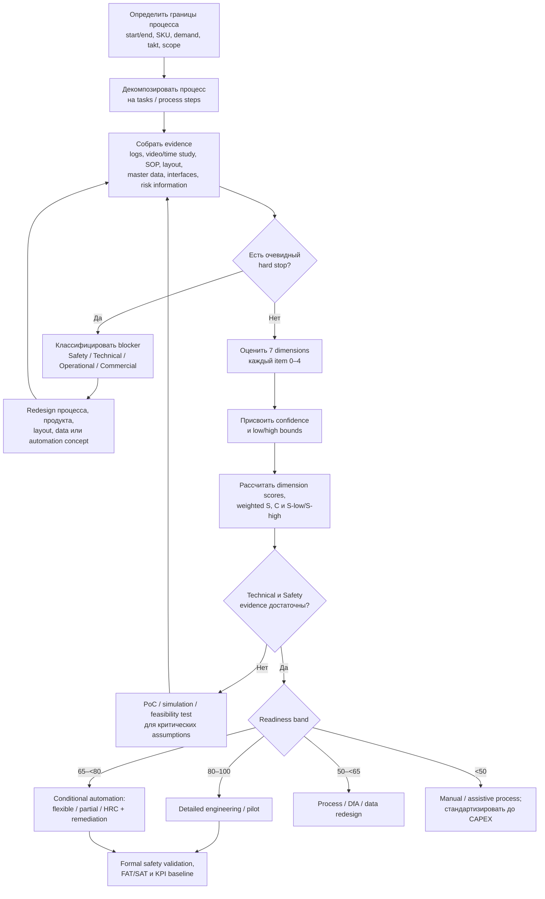

# Готовность конкретного производственного или логистического процесса к автоматизации и роботизации: исследовательская база и модель RobCo

## Резюме для руководства

Для оценки **готовности конкретного процесса**, а не «цифровой зрелости предприятия», наиболее полезна не одна существующая шкала, а сочетание четырех исследовательских линий: **task-level декомпозиции и Levels of Automation**, методов **automation potential / fitness for automation**, требований **безопасности роботизированных систем**, а также стандартов и практик **интеграции производственных и корпоративных систем**. Frohm et al. предлагают рассматривать автоматизацию на уровне задач, отдельно оценивая физическую и информационно-когнитивную автоматизацию; DYNAMO переносит такую логику на картирование потока и поиск будущих вариантов автоматизации. Более новые работы Malik & Bilberg и Jakschik et al. также начинают не с «зрелости завода», а с декомпозиции процесса на операции и оценки пригодности каждой операции для человека, робота либо гибридного выполнения. citeturn16search3turn16search0turn16search2turn18search1

Наиболее близкий к требуемой RobCo модели промышленный подход найден у Fraunhofer IPA: **Automation Potential Analysis (APA)** разбивает, например, сборку на разделение/подачу, манипулирование, позиционирование и соединение; для каждого шага оценивает *Fitness for Automation*, после чего техническую пригодность сопоставляет с экономическим потенциалом. Итогом может быть рекомендация полной, частичной автоматизации или HRC. Fraunhofer сообщает о более чем 500 применениях методики и расширении подхода за пределы сборки на сварку и интралогистику. citeturn17search1turn17search3turn17search7

Вендоры не дают универсального научно валидированного «readiness index». Вместо этого ABB, KUKA и FANUC фактически используют **application-engineering filters**: payload, reach, cycle time, floor space, product variability, safety, tooling/vision и характеристики среды. Siemens концентрируется на другом слое — стандартизованных интерфейсах, OPC UA/MQTT/REST, MES/ERP и вертикальной интеграции. Эти параметры чрезвычайно полезны для RobCo, но их следует маркировать как **product/vendor heuristics**, а не как академически установленные пороги готовности. citeturn15search1turn15search2turn21search3turn15search9turn15search14

Предлагаемая модель RobCo состоит из **семи измерений**:

| Измерение RobCo | Вес | Основной вопрос |
|---|---:|---|
| Детерминизм и стандартизация процесса | **20%** | Насколько процесс описываем, повторяем и свободен от неструктурированных исключений? |
| Физическая и технологическая реализуемость | **20%** | Может ли технология стабильно выполнить работу по payload/reach/tolerance/cycle/grasp? |
| Безопасность и управляемость взаимодействия с человеком | **15%** | Можно ли получить валидируемую безопасную архитектуру? |
| Компоновка, стабильность layout и среда | **10%** | Подходит ли физическая среда и насколько долго останется релевантной? |
| Инженерная инфраструктура и сеть | **10%** | Есть ли необходимые utilities, OT/network и эксплуатационная инфраструктура? |
| Данные и интеграция WMS/MES/ERP | **10%** | Есть ли данные, идентификаторы, интерфейсы и история, необходимые для управления? |
| Пропускная способность и экономический потенциал | **15%** | Дает ли автоматизация достаточный capacity/business-case при реалистичных рисках? |

**Ключевой принцип:** weighted score никогда не должен «компенсировать» невозможность безопасного или технического выполнения. Поэтому RobCo следует использовать одновременно **hard-stop gates + weighted score + confidence score**, а не один интегральный балл. Это соответствует логике ISO 10218/ISO 3691-4, где безопасность является требованием к проекту и интеграции, а не дополнительным баллом за зрелость. citeturn19search0turn19search1turn19search2

Рекомендуемый выход assessment:

\[
\boxed{\text{Readiness} = (S,\; C,\; [S_{low},S_{high}],\; blockers)}
\]

где `S` — готовность 0–100, `C` — уверенность в доказательствах 0–1, интервал показывает неопределенность, а `blockers` перечисляет непреодоленные технические/безопасностные ограничения. **RobCo не следует умножать readiness на confidence**: отсутствие данных означает неопределенность, а не автоматически низкую пригодность.

Все конкретные числовые пороги ниже, если прямо не сказано обратное, являются **предлагаемой RobCo operational rubric**, созданной на основе литературы и инженерных практик; это не пороги ISO, ABB, KUKA, FANUC или Fraunhofer. Они должны быть откалиброваны после накопления портфеля реальных RobCo проектов.

## Синтез исследовательской базы

В литературе полезно различать три разных понятия, которые иногда смешиваются.

**Level of Automation** отвечает на вопрос *«кому — человеку или машине — сейчас поручена эта функция и насколько?»*. Frohm et al. разделяют физико-механическую и когнитивно-информационную автоматизацию и предлагают семиступенчатые шкалы. Это полезно RobCo прежде всего как принцип декомпозиции и выбора целевого распределения задач, но само по себе не является readiness score. citeturn16search3

**Automation suitability / Fitness for Automation** отвечает на вопрос *«насколько данная операция технически удобна для автоматизации?»*. Именно сюда относятся Malik & Bilberg, MTM-1-HRC Jakschik et al. и Fraunhofer APA. Malik & Bilberg оценивают задачи и свойства компонентов для распределения операций между человеком и роботом; Jakschik et al. декомпозируют сборочный процесс через MTM и классифицируют пригодность отдельных операций; APA оценивает отдельные шаги на основе технических критериев и затем добавляет экономическую составляющую. citeturn16search2turn18search1turn17search1

**Readiness** в предлагаемом смысле RobCo шире Fitness for Automation: даже прекрасно роботизируемая операция может быть **не готова к внедрению**, если неизвестен takt, нет стабильной подачи деталей, отсутствует безопасная компоновка, WMS не имеет интерфейса либо экономический эффект исчезает при реальном product mix. Это синтез приведенных источников, а не терминология одного стандарта. Fraunhofer прямо разделяет технические и экономические критерии, а ISA-95 отдельно показывает необходимость формально определять информационные границы и обмены между manufacturing-control и enterprise functions. citeturn17search3turn19search8turn19search10

### Сравнение наиболее релевантных фреймворков

| Источник / подход | Единица анализа | Что реально оценивает | Что RobCo стоит заимствовать | Что подход **не** дает |
|---|---|---|---|---|
| **Frohm, Lindström, Winroth, Stahre — Levels of Automation** | Производственная задача/функция | Физический и когнитивный LoA, по 7 уровням | Разделение physical vs information automation; task-level анализ | Не дает полной readiness/economic/safety rubric. citeturn16search3 |
| **DYNAMO** | Элемент производственного value flow | Текущий LoA и потенциальные изменения LoA | Картирование процесса до выбора технологии; анализ по частям потока | Не является стандартным инвестиционным индексом. citeturn16search0 |
| **Lindström / Winroth — strategic LoA** | Производственная система/подпроцесс | Соответствие выбранного LoA стратегии производства | Не оптимизировать только техническую возможность; учитывать стратегическую цель и lifecycle | Более высокий уровень, чем искомый RobCo process score. citeturn16search12 |
| **Salmi et al.** | Сборочный процесс на стадии design | Выбор LoA с учетом нескольких критериев | Принимать решение рано, когда архитектуру еще можно менять; не сводить выбор к одной технической метрике | Не дает универсальной современной шкалы readiness 0–100. citeturn16search1turn16search5 |
| **Malik & Bilberg** | Отдельная сборочная задача | Automation potential и распределение human/robot | Оценивать каждый task, свойства компонентов, cycle/adaptability/safety | Сфокусирован на collaborative assembly. citeturn16search2 |
| **Jakschik et al., MTM-1-HRC** | Элементарные движения и подпроцессы | Automation/HRC suitability на базе существующих time data | Формализованная декомпозиция вместо оценки «в целом кажется роботизируемым» | Авторы позиционируют метод прежде всего как быстрый potential analysis; требуется дальнейшая проверка универсальности классификации. citeturn18search1 |
| **Barbu & Auer, Fitness for Automation** | Сборка/компоненты | Техническая FfA из product model | Отделение «легкости реализации» от savings potential; воспроизводимость через данные продукта | Новый метод, пока с ограниченной эмпирической базой. citeturn18search0turn18search4 |
| **Fraunhofer IPA APA** | Каждый process step | Technical Fitness for Automation + economic prioritization | Наиболее близкий precedent: разбивать процесс, балльно оценивать технологические свойства, отдельно учитывать экономику, выдавать full/partial/HRC | Полная rubric и веса являются proprietary/applied know-how и публично не раскрыты. citeturn17search1turn17search3 |

Систематический обзор Petzoldt et al. подтверждает, что **assessment of automation potential отдельных process steps** является отдельным классом методов task allocation в HRC. Поэтому для RobCo логичнее строить оценку снизу вверх, от элементарных операций, а не переносить enterprise-level Industry 4.0 maturity model на один процесс. citeturn18search3

Fraunhofer дает особенно полезную инженерную детализацию: в assembly APA этапы разделяются на **separating, handling, positioning, joining**; среди факторов упоминаются, например, жесткость/гибкость материала, свойства подачи, геометрия для позиционирования и движения соединения. Отдельные feasibility studies проверяют надежность процесса, достижимость cycle time и компенсируемые допуски экспериментально, что поддерживает предлагаемое RobCo требование повышать confidence через реальные trials, а не только expert judgement. citeturn17search3turn17search11

Для логистики safety layer отличается от stationary robot cell. ISO 3691-4:2023 охватывает driverless industrial trucks, включая AGV и AMR, и прямо рассматривает систему вместе с рабочей зоной; следовательно, для мобильной роботизации свойства маршрута, traffic interaction и физической среды нельзя считать характеристиками только самого робота. citeturn19search2

Для информационного слоя ISA-95/IEC 62264 дает не readiness score, а **reference architecture для enterprise–control integration**: определяет функции, модели данных и обмены между manufacturing operations и business systems; уровень 3 обычно соответствует MOM/MES, уровень 4 — business planning/ERP. В 2025 году ISA выпустила обновление Part 1, вновь подчеркивающее стандартизованные integration interfaces и semantic models. citeturn19search8turn19search10turn19search21

Отдельно для OT-network/security целесообразно использовать ISA/IEC 62443 как обязательную reference family при проектировании, но **не превращать cybersecurity maturity всего предприятия в readiness dimension процесса**. Серия 62443 задает процессы и требования к безопасности industrial automation and control systems; для RobCo достаточно в pre-assessment проверить, существует ли допустимая, управляемая OT-архитектура для требуемого решения. citeturn15search0

Русскоязычная нормативная база существенно полезнее найденных русскоязычных maturity-like публикаций именно для safety gate. По состоянию на **9 сентября 2026 года** действуют ГОСТ Р 60.1.2.1-2016/ИСО 10218-1:2011, ГОСТ Р 60.1.2.2-2016/ИСО 10218-2:2011 и ГОСТ Р 60.1.2.3-2021/ISO/TS 15066:2016. При этом международные ISO 10218-1 и ISO 10218-2 уже обновлены в 2025 году. Следовательно, для российского проекта следует отдельно фиксировать **юрисдикцию и применимый набор нормативных требований**, а не автоматически подменять действующий ГОСТ последней редакцией ISO. citeturn20search0turn20search1turn20search2turn19search5

В российской академической выборке также встречается акцент на связи роботизации с показателями производственной системы и экономико-производственным эффектом, а не на универсальной process-readiness шкале; это согласуется с необходимостью отдельно считать техническую пригодность и performance/economics. citeturn6search2turn6search3

## Вендорские и интеграторские эвристики

Вендорский материал необходимо держать **отдельно от evidence layer**. Каталожная логика отвечает преимущественно на вопрос *«какая технология подойдет после того, как процесс выбран?»*, а академическая readiness-логика — *«правильно ли вообще этот процесс автоматизировать и при каких условиях?»*.

### Что фактически проверяют поставщики

| Практика | Публично используемые параметры | Значение для RobCo | Статус |
|---|---|---|---|
| **ABB** | Payload, reach, precision/repeatability, cycle/layout; при machine tending — part size, payload, safety, feeding, vision; RobotStudio используется для reach/cycle/layout validation | Основание для physical feasibility и simulation evidence | **Vendor heuristic / product engineering**, не научная readiness scale. citeturn21search3turn21search11 |
| **KUKA** | Payload, reach, cycle time, product variability, available floor space, safety, future scalability; industrial robot vs cobot | Хороший набор technology-routing variables | **Vendor heuristic.** citeturn15search2turn15search5 |
| **FANUC** | Для palletizing: payload, reach, duty, cycle time, floor space; в payload необходимо учитывать product, EOAT и dressout | Поддерживает проверку physical envelope; полезно для паллетизации/handling | **Vendor heuristic / sizing requirement.** citeturn15search1 |
| **FANUC SCARA** | Speed, payload/reach, компактность и варианты исполнения для food/cleanroom | Environment и technology fit должны проверяться до robot selection | **Product practice.** citeturn15search7 |
| **Siemens** | Standardized horizontal/vertical interfaces, PROFINET, OPC UA; OPC Router связывает machine/OT с MQTT, REST, SQL, MES и ERP | Основание для data/integration readiness | **Architecture/vendor practice**, соответствующая принципам interoperability. citeturn15search9turn15search14 |
| **ABB controls** | OPC UA, MQTT, PROFINET, EtherNet/IP, Modbus и др.; интеграция control/safety/motion/HMI | Проверять не наличие «Ethernet вообще», а supported interface и operational ownership | **Vendor integration practice.** citeturn21search2 |
| **ATS / system integration** | Pre-automation risk assessment, requirements, simulation, data-driven validation, interface/material-flow definition, PoC risk mitigation | Поддерживает RobCo stage-gated workflow до закупки оборудования | **Integrator practice.** citeturn21search4turn21search8 |

Существенная закономерность вендорских материалов: **product variability не означает автоматически “не автоматизировать”**. KUKA прямо включает variability в выбор между cobot и industrial robot; ABB предлагает vision и flexible feeding для различных деталей; Fraunhofer указывает, что высокий variant count и сложная подача повышают сложность, но могут быть компенсированы product/process redesign. Поэтому RobCo должен снижать балл за вариативность только тогда, когда она **неструктурирована или не покрыта recipe/vision/tooling strategy**, а не просто потому, что SKU много. citeturn15search2turn21search3turn17search1

То же относится к human interaction. Частое присутствие человека само по себе не должно автоматически делать readiness низкой: оно может означать, что целевая архитектура — HRC/cobot/assistive automation, а не fenced industrial cell. ISO/TS 15066 задает требования к collaborative systems и work environment, а Fraunhofer APA допускает HRC как отдельный outcome. citeturn19search1turn17search1

И напротив, красивые vendor ROI claims нельзя превращать в норматив. Например, текущая страница ABB machine tending сообщает типичный для ее решений ROI 18–24 месяца, но это **маркетинговая/прикладная оценка конкретного application family**, а не доказанный универсальный threshold готовности. RobCo разумнее задавать собственный hurdle rate/payback policy и проводить sensitivity analysis. citeturn21search3

## Рекомендуемая модель RobCo

Модель применяется **к определенной границе процесса**, например: «снятие детали с CNC → контроль ориентации → укладка», «перемещение паллет от упаковки до склада», «mixed-SKU palletizing», а не к цеху в целом.

До scoring должны быть зафиксированы `process start`, `process end`, product/SKU population, peak demand, shift pattern, target takt/service level, рассматриваемый automation concept и список исключений. Без этого один и тот же процесс можно искусственно получить как «готовый» или «не готовый».

Все scored items используют шкалу:

\[
x_i \in \{0,1,2,3,4\}
\]

\[
S_d=100\times\frac{\sum_i a_i(x_i/4)}
{\sum_i a_i}
\]

где \(a_i\) — внутренний вес вопроса. Для первой версии RobCo рекомендуется **равный вес вопросов внутри dimension**. `N/A` разрешается только если параметр действительно неприменим; denominator тогда пересчитывается. **Unknown ≠ N/A**: отсутствие данных оценивается через confidence и uncertainty interval.

Общий score:

\[
S=\sum_d w_dS_d,\qquad \sum_dw_d=1
\]

### Детальная rubric

| Dimension / вопрос | Тип метрики | RobCo scoring `4 / 3 / 2 / 1 / 0` | Hard stop |
|---|---|---|---|
| **Детерминизм и стандартизация — 20%** ||||
| Доля циклов, следующих документированному standard route без незапланированного вмешательства | continuous, % | `≥95 / 90–<95 / 75–<90 / 50–<75 / <50%` | Если невозможно однозначно определить sequence и acceptance criterion критической операции |
| Exception/rework/manual-recovery rate | continuous, % циклов | `≤1 / >1–3 / >3–7 / >7–15 / >15%` | Массовые исключения неизвестной причины, не наблюдаемые системой |
| Coverage вариантов: доля фактического объема SKU/recipes с формально заданными route, parameters и acceptance rules | continuous | `≥95 / 80–<95 / 60–<80 / 30–<60 / <30%` | Критичные варианты не могут быть идентифицированы до выполнения операции |
| Conformance входа: доля деталей/грузов, соответствующих заявленной геометрии, позе, упаковке, маркировке и master data | continuous | `≥99.5 / 98–<99.5 / 95–<98 / 90–<95 / <90%` | Нет наблюдаемого/контролируемого состояния входа для критической операции |
| **Физическая и технологическая реализуемость — 20%** ||||
| Минимальный engineering headroom по payload, wrist moment и inertia после учета продукта, EOAT и кабелей | continuous | `≥30 / 20–<30 / 10–<20 / 0–<10 / constraint exceeded` | Любой обязательный load/moment/inertia constraint превышен |
| Reach/pose/access margin по simulation или layout study | continuous/ordinal | `≥20 / 10–<20 / 5–<10 / 0–<5 / critical pose unreachable` | Неразрешимые collision/singularity/access constraints |
| Cycle margin \(R=takt/P90(cycle)\) | continuous | `≥1.25 / 1.15–<1.25 / 1.05–<1.15 / 1.00–<1.05 / <1.00` | Даже реалистично оптимизированный concept не достигает required rate |
| Успех grasp/detect/process/place на representative test | continuous | `≥99.9 / 99–<99.9 / 97–<99 / 90–<97 / <90% или feasibility не доказана` | Нет практически реализуемого EOAT/sensor/process concept для обязательной операции |
| **Безопасность и управляемость взаимодействия — 15%** ||||
| Статус risk assessment | ordinal | `final assessment + validated safeguards / assessment complete, validation pending / hazards identified / informal review / absent` | Обнаружен residual risk, который не может быть снижен до приемлемого уровня применимым safety concept |
| Coverage human interaction: доля взаимодействий, для которых определены operating mode, safe state и recovery procedure | continuous | `≥99.9 / 99–<99.9 / 95–<99 / 80–<95 / <80%` | Есть неизбежное взаимодействие человека с hazard без compliant concept |
| Реализуемость safeguarding / collaborative measures в доступном пространстве | ordinal | `validated + ≥20% spatial margin / 10–20 / 0–10 / redesign needed / infeasible` | Требуемую защиту невозможно физически разместить или валидировать |
| Recovery/maintenance safety: lockout, access, reset/restart и abnormal-state handling | ordinal | `fully specified+tested / specified / partial / ad hoc / absent` | Безопасное устранение ожидаемых отказов невозможно |
| **Компоновка и среда — 10%** ||||
| Horizon стабильности layout | continuous, months | `>24 / 12–24 / 6–<12 / 3–<6 / <3 или неизвестен` | Планируемое изменение уничтожает business/physical concept до окупаемости |
| Space/maintenance envelope margin | continuous | `≥20 / 10–<20 / 0–<10 / major rearrangement / physically impossible` | Нет допустимого рабочего/сервисного пространства |
| Environment compatibility: temperature, dust, liquids, hygiene, cleanroom, ATEX-like requirements и т. п. | ordinal | `standard equipment fits / standard option / enclosure or conditioning / major custom engineering / no compliant technology identified` | Среда несовместима с доступной безопасной технологией |
| Для AMR/AGV: доля missions с blockage/route intervention из-за фактической среды | continuous, optional | `≤0.5 / >0.5–2 / >2–5 / >5–10 / >10%` | Критический маршрут невозможно сделать безопасным/проходимым |
| **Инфраструктура и сеть — 10%** ||||
| Utilities — power, air, vacuum, charging и др.: reserve capacity | continuous | `≥25 / 10–<25 / 0–<10 / upgrade needed / supply infeasible` | Необходимый utility физически нельзя обеспечить |
| Availability сети в зоне, **если** она operationally critical | continuous | `≥99.9 / 99.5–<99.9 / 99–<99.5 / 95–<99 / <95%` | Архитектура требует connectivity, а гарантировать ее нельзя и offline-safe mode отсутствует |
| Managed OT architecture: segmentation, managed switching, addressing, diagnostics, change ownership | ordinal | `standardized+monitored / documented managed / partial / ad hoc / prohibited or uncontrolled` | Требуемое подключение нарушает обязательную security policy и альтернативы нет |
| Maintenance infrastructure: access, tooling, spare/charging/service strategy | ordinal | `fully ready / small additions / moderate additions / major redesign / operationally infeasible` | Невозможно безопасно обслуживать критическое оборудование |
| **Данные и WMS/MES/ERP-интеграция — 10%** ||||
| Completeness/accuracy обязательных master data: SKU, location, routing/BOM/order identifiers | continuous | `≥99.5 / 98–<99.5 / 95–<98 / 90–<95 / <90%` | Closed-loop automation требует идентификатор, который нельзя надежно получить |
| Critical event coverage: автоматически timestamped/identified state transitions | continuous | `≥95 / 80–<95 / 60–<80 / 30–<60 / <30%` | Для требуемого control loop состояние процесса принципиально недоступно |
| Interface readiness WMS/MES/ERP/PLC/WCS | ordinal | `documented supported interface + test env / supported interface / middleware or batch / proprietary/manual / required integration impossible` | Обязательный интерфейс запрещен/недоступен и нет допустимого workaround |
| Representative operational history | continuous | `≥12 weeks / 4–<12 / 1–<4 / manual sample only / none` | Обычно не hard stop; снижает confidence |
| **Пропускная способность и экономика — 15%** ||||
| Capacity ratio \(P90\ automated\ capacity / peak\ required\ capacity\) | continuous | `≥1.30 / 1.15–<1.30 / 1.05–<1.15 / 1.00–<1.05 / <1.00` | Если capacity является обязательным требованием и concept его не выполняет |
| Доля текущего task labor time, реально addressable автоматизацией | continuous | `≥80 / 60–<80 / 40–<60 / 20–<40 / <20%` | Нет технического hard stop; может остановить инвестицию |
| Ожидаемая загрузка автоматизированного assets в downside-demand case | continuous | `≥70 / 55–<70 / 40–<55 / 25–<40 / <25%` | Commercial gate по политике компании |
| Simple payback, default RobCo | continuous | `≤2 / >2–3 / >3–4 / >4–5 / >5 years или отрицательный business case` | Commercial gate, если превышен corporate hurdle |

**Основание для первых двух измерений** — task decomposition, physical/cognitive LoA, MTM-HRC, Malik & Bilberg и Fraunhofer APA; конкретные проценты и margin bands являются RobCo-порогами для operationalization, поскольку литература не дает универсальных cross-industry cut-offs. citeturn16search3turn16search2turn18search1turn17search3

Для payload/reach/cycle нельзя использовать только номинальную массу детали: FANUC прямо рекомендует учитывать также EOAT и dressout, а ABB демонстрирует, что модели различаются по payload, reach и precision. Финальное sizing должно использовать manufacturer load diagrams, center-of-gravity/inertia constraints и simulation конкретной траектории; предложенный headroom — только screening metric. citeturn15search1turn21search11

Threshold для cycle специально задан через **P90**, а не лучший nominal cycle. Это RobCo-рекомендация для защиты от оценки по идеальному demo-cycle; Fraunhofer feasibility practice аналогично предполагает тестовые серии с изменением параметров/допусков и документирование результатов. citeturn17search11

Safety scores являются **индикаторами project readiness, а не доказательством соответствия стандарту**. Для industrial robot cell применимость должна проверяться относительно ISO 10218-2:2025 и локального законодательства; collaborative application дополнительно затрагивает ISO/TS 15066; для AGV/AMR — ISO 3691-4. В России требуется отдельно проверить применимость действующих ГОСТ и иных обязательных требований проекта. citeturn19search0turn19search1turn19search2turn20search0turn20search2

Network availability также является **RobCo heuristic**, а не Siemens/ISA requirement. Низкая network score не должна штрафовать локально автономную fixed cell, которой enterprise connectivity нужна лишь для reporting. Напротив, для WMS-dispatched fleet AMR потеря connectivity может быть архитектурно значимой. Siemens и ABB подтверждают широкое применение OPC UA, MQTT, PROFINET, REST и других интерфейсов, но надежность должна оцениваться относительно архитектуры конкретного процесса. citeturn15search9turn15search14turn21search2

### Почему именно такие веса

Высокие веса **Process 20% + Physical 20%** отражают фундаментальный вывод исследовательских методов: automation potential появляется на уровне конкретной задачи и ее технических характеристик. Именно на этом строятся LoA/DYNAMO, MTM-HRC, Malik & Bilberg и APA. citeturn16search3turn18search1turn16search2turn17search1

**Safety 15%** получает меньший арифметический вес только потому, что он одновременно является **gate**: плохую безопасность нельзя компенсировать высокой экономикой. Это принципиально важнее разницы между весом 15% и 20%. citeturn19search0turn19search1

**Economics/throughput 15%** отделена от technical FfA, что близко к логике Fraunhofer: техническая возможность и экономическая целесообразность — разные axes решения. citeturn17search3

Layout/environment, infrastructure/network и data/integration получают по **10%**, поскольку часто являются **remediable enablers**: можно перестроить зону, провести питание, улучшить Wi-Fi/industrial network, создать interface adapter или исправить master data. Это не означает их неважность: каждый из них может стать hard stop, если изменение невозможно. ISA-95 и vendor integration practice поддерживают необходимость явно проектировать interfaces и system boundaries. citeturn19search8turn15search9

## Блокеры, интерпретация результата и модель уверенности

### Hard stops

RobCo должен проверять блокеры **до** использования итогового score. Предлагаются четыре класса.

| Gate | Состояние hard stop | Что делать вместо «снижать балл» |
|---|---|---|
| **Safety gate** | Нет реализуемой архитектуры снижения residual risk / неизвестна критическая hazard situation | Остановить concept; redesign process/cell/interaction |
| **Technical gate** | Обязательный payload/reach/force/tolerance/cycle/process capability не достижим доступной технологией | DfA/process redesign, разделение task, другой technology class |
| **Operational gate** | Автоматизация требует недоступного input/state/interface/utility | Исправить upstream process/infrastructure/data architecture |
| **Commercial gate** | Business case нарушает обязательные инвестиционные критерии компании | Не внедрять или уменьшить scope/перейти к partial automation |

Safety/technical gates должны быть абсолютными; commercial gate зависит от стратегии. Fraunhofer отдельно отмечает, что технически возможное решение не обязательно экономически оправдано и наоборот. citeturn17search3

### Интерпретация score

Это **RobCo decision policy**, а не published standard:

| Score при отсутствии hard stop | Интерпретация | Предпочтительный следующий шаг |
|---:|---|---|
| **80–100** | Высокая process readiness | Detailed engineering / pilot / FAT-SAT planning; standard automation возможна при высокой confidence |
| **65–<80** | Условно готов | PoC для рискованных functions, partial/flexible automation, закрытие слабых dimensions |
| **50–<65** | Process redesign before automation | Standardization, DfA, feeding/layout/data redesign; автоматизировать только отдельные subtasks |
| **<50** | Низкая готовность | Сохранить manual/assistive operation и сначала устранить fundamental variability/uncertainty |

Важно различать **readiness to engineer** и **permission to release into production**. Score 85 с предварительным, но не валидированным safety concept означает «хороший кандидат для проекта», а не «можно запускать робот».

Профиль score также должен определять **тип автоматизации**, а не только go/no-go:

| Профиль | Наиболее логичная архитектура |
|---|---|
| Высокий determinism + high volume + stable layout + низкая потребность в human access | Fixed industrial robot, dedicated automation, conveyor/ASRS |
| Средняя product variability, но хорошая идентификация и physical feasibility | Flexible robot + vision + recipe switching + quick-change tooling |
| Регулярное структурированное human interaction | Cobot/HRC или semi-automation после полноценного safety assessment |
| Переменный маршрут, distributed transport, стабильная карта/инфраструктура | AMR/AGV |
| Очень стабильный маршрут и высокий непрерывный flow | Fixed conveyor/transfer system может быть рациональнее мобильного робота |
| Низкая стандартизация, частые tacit decisions/exceptions | Сначала process redesign; automation assistant вместо full automation |

Такое technology routing согласуется с KUKA, которая связывает выбор industrial robot/cobot с payload, cycle, variability, floor space и safety, с FANUC application-selection logic и с Fraunhofer outcome `full / partial / HRC`. citeturn15search2turn15search1turn17search1

### Confidence model

Для каждого вопроса \(i\) дополнительно записывается confidence \(c_i\):

| `c_i` | Качество доказательства | RobCo default |
|---:|---|---|
| **1.00** | Representative production logs / acceptance or feasibility test, покрывающий реальные variants/shifts | Высшая уверенность |
| **0.80** | Прямое измерение на нескольких сменах или репрезентативный calibrated simulation/test | Высокая |
| **0.60** | Малый controlled sample, документированный SOP/master-data audit, pilot с ограниченным variant coverage | Средняя |
| **0.40** | Engineering estimate, vendor sizing или аналогичный ранее реализованный процесс | Низкая |
| **0.20** | Interview/assumption без независимого подтверждения | Очень низкая |
| **0** | Unknown | Нет доказательства |

Конкретные границы sampling следует настраивать по process risk; Fraunhofer feasibility studies дают хороший эталон философии — испытания на реальном/лабораторном оборудовании, серии циклов с различными параметрами и документирование протоколов вместо единичной демонстрации. citeturn17search11

Confidence dimension:

\[
C_d=\frac{\sum_i a_ic_i}{\sum_i a_i}
\]

Overall confidence:

\[
C=\sum_dw_dC_d
\]

Кроме среднего RobCo должен показывать:

\[
C_{critical}=\min(C_{process},C_{physical},C_{safety})
\]

Это предотвращает ситуацию «90% отличных ERP-данных скрыли то, что никто еще не проверял захват детали».

Рекомендуемые RobCo confidence bands:

| Confidence | Использование результата |
|---:|---|
| **≥0.85** | Достаточно доказательств для инвестиционного решения при закрытых gates |
| **0.70–<0.85** | Инженерное решение возможно, но нужна targeted validation |
| **0.50–<0.70** | Score следует считать hypothesis; нужен PoC/data collection |
| **<0.50** | Assessment exploratory, CAPEX decision преждевременен |

Для critical safety evidence RobCo разумно требовать более высокий уровень, чем для обычных экономических предположений; точный approval threshold должен быть частью internal governance и не заменяет formal safety validation. Требования ISO касаются безопасности интегрированного решения на протяжении design/integration/commissioning/operation/maintenance, а не confidence score анкеты. citeturn19search11

### Интервал неопределенности

Каждому малоизвестному item следует присвоить не только best estimate \(x_i\), но и допустимый диапазон \([x_i^L,x_i^U]\). Тогда:

\[
S^L=\sum_d w_dS_d^L,\qquad
S^U=\sum_d w_dS_d^U
\]

Например, vendor утверждает, что cycle будет 8.5–10.5 s при takt 10 s. Вместо преждевременного score `2` следует показать диапазон от `0` до `2` до проведения simulation/test. Инвестиционное решение логичнее основывать на **conservative \(S^L\)** либо специально закрывать uncertainty тестированием.

Именно поэтому рекомендуемый RobCo dashboard должен показывать не `Readiness = 78`, а, например:

> **Readiness 78/100 · Confidence 0.63 · plausible range 61–84 · 0 hard safety stops · 2 unresolved technical assumptions.**

## Пример расчета и рекомендуемые визуализации

Рассмотрим условный процесс: **mixed-SKU palletizing коробов с конвейера на паллеты**. SKU и задания приходят из WMS; рассматривается industrial robot с vision и автоматической сменой recipes. Это исключительно mock data, не реальный RobCo объект.

### Исходные оценки

| Dimension | Пример evidence | Item scores | \(S_d\) | Confidence |
|---|---|---:|---:|---:|
| Process determinism | 96% standard cycles; 2.2% exceptions; 100% recipes; 99.1% conforming input | 4, 3, 4, 3 | **87.5** | 0.90 |
| Physical feasibility | 22% load headroom; 12% reach margin; takt/P90 cycle=1.27; 99.5% pick success | 3, 3, 4, 3 | **81.25** | 0.80 |
| Safety / interaction | risk assessment готов, final validation еще впереди; interaction structured | 3, 3, 3, 3 | **75.0** | 0.80 |
| Layout/environment | стабильность ≈18 мес.; space и environment требуют небольших reserve allowances | 3, 3, 3 | **75.0** | 0.85 |
| Infrastructure/network | utilities готовы; network и OT architecture документированы, но не redundant | 4, 3, 3 | **83.3** | 0.90 |
| Data/integration | master data good; неполная event history; WMS middleware нужен | 3, 2, 2, 3 | **62.5** | 0.65 |
| Throughput/economics | strong capacity/labor case, хороший payback, умеренная downside utilization | 4, 4, 3, 4 | **93.75** | 0.70 |

Расчет первой dimension:

\[
S_{process}=
100\times \frac{4+3+4+3}{4\times4}
=87.5
\]

Взвешенный результат:

\[
\begin{aligned}
S=&(87.5)(0.20)+(81.25)(0.20)+(75)(0.15)\\
&+(75)(0.10)+(83.3)(0.10)+(62.5)(0.10)+(93.75)(0.15)\\
=&\mathbf{81.14}
\end{aligned}
\]

Overall evidence confidence:

\[
\begin{aligned}
C=&(0.90)(0.20)+(0.80)(0.20)+(0.80)(0.15)\\
&+(0.85)(0.10)+(0.90)(0.10)+(0.65)(0.10)+(0.70)(0.15)\\
=&\mathbf{0.805}
\end{aligned}
\]

То есть результат следует сообщать как **81.1/100, confidence ≈0.81**. По RobCo rubric это высокий readiness candidate, но он **еще не production-release-ready**, поскольку final safety validation и WMS integration testing в mock scenario не закончены. Именно такой вывод предпочтительнее, чем «81 > 80, значит покупать робота».

### Radar chart

Radar должен отображать **семь dimension scores, а не 25 отдельных вопросов**. Его цель — показать архитектурный профиль: здесь явно видны слабые Data/Integration и Safety относительно сильной экономики.

Практически полезно рядом с radar показывать confidence каждой оси или второй, пунктирный контур \(S^L\). Radar не следует использовать как единственный decision chart: площадь многоугольника визуально может скрывать значимость weights и hard stops.

### Weighted score breakdown

Для инвестиционного комитета предпочтительнее горизонтальный breakdown: он показывает реальный вклад каждой dimension в 100-point score.

В mock example вклад равен приблизительно:

| Dimension | Max possible contribution | Actual contribution |
|---|---:|---:|
| Process | 20.0 | **17.50** |
| Physical | 20.0 | **16.25** |
| Safety | 15.0 | **11.25** |
| Layout/environment | 10.0 | **7.50** |
| Infrastructure/network | 10.0 | **8.33** |
| Data/integration | 10.0 | **6.25** |
| Throughput/economics | 15.0 | **14.06** |
| **Total** | **100** | **81.14** |

Такой график полезнее radar при сравнении проектов, потому что показывает влияние выбранных weights.

### Assessment workflow

Workflow объединяет то, что в исследованиях обычно разбросано по разным методам: task-level decomposition из LoA/HRC методов, технический Fitness for Automation из APA, feasibility validation через testing/simulation и отдельную enterprise integration perspective ISA-95. citeturn16search3turn18search1turn17search1turn19search8

## Практическое применение, ограничения и итоговая карта доказательств

### Что считать evidence, а что эвристикой

Самое важное организационное правило для RobCo — **не смешивать три уровня доказательности в одной колонке без маркировки**:

| Категория | Что в модели к ней относится | Как использовать |
|---|---|---|
| **Academic / standards evidence** | Task decomposition; разделение physical/information automation; необходимость task-level assessment; risk-based safety; enterprise-control interface modeling | Обосновывает **состав dimensions и принцип анализа** |
| **Industrial research / validated practice** | Fraunhofer APA, feasibility studies, technical + economic FfA, full/partial/HRC outcome | Обосновывает **структуру workflow и необходимость FfA + economics + tests** |
| **Vendor / integrator practice** | Payload, reach, cycle, floor space, variability, vision, protocols, simulation, pre-automation risk reduction | Обосновывает **инженерные вопросы и technology routing** |
| **RobCo heuristic** | Веса 20/20/15/10/10/10/15, границы 95%, 99.5%, 1.25 cycle ratio, 2–5 year payback bands, score bands 80/65/50, confidence bands | Рабочая **scoring calibration**, которую нужно проверять на портфеле RobCo проектов |

Это разделение необходимо, поскольку даже сильные источники подтверждают, **какие факторы значимы**, но обычно не подтверждают, что, например, «95% repeatability = score 4» для любого процесса. Fraunhofer также использует specific criteria и weighting по требованиям клиента, а не публично заявленную универсальную одинаковую шкалу для всех отраслей. citeturn17search1

### Mapping выбранных dimensions на источники

| RobCo dimension | Академическая / стандартизованная опора | Индустриальная / vendor practice |
|---|---|---|
| **Determinism & standardization** | Frohm LoA; DYNAMO; Jakschik MTM task decomposition; Salmi decision methods. citeturn16search3turn16search0turn18search1turn16search1 | Fraunhofer APA process-step scoring; ABB standardized feeding; KUKA product variability. citeturn17search3turn21search3turn15search2 |
| **Physical/process feasibility** | Malik & Bilberg task/component characterization; MTM-HRC; FfA approaches. citeturn16search2turn18search1turn18search0 | Fraunhofer handling/positioning/joining criteria; ABB/FANUC/KUKA payload, reach, cycle. citeturn17search3turn15search1turn15search2turn21search11 |
| **Safety/human interaction** | ISO 10218-2:2025; ISO/TS 15066; ГОСТ Р 60.1.2.2 и 60.1.2.3. citeturn19search0turn19search1turn20search0turn20search2 | KUKA cobot vs industrial robot; ABB collaborative vs fenced solutions. citeturn15search2turn21search3 |
| **Layout/environment** | ISO 3691-4 для mobile systems и operating zone; safety standards для integrated cell. citeturn19search2turn19search11 | FANUC floor space/environment variants; KUKA floor space; ABB layout simulation. citeturn15search1turn15search7turn15search2turn21search3 |
| **Infrastructure/network** | ISA/IEC 62443 — IACS security framework. citeturn15search0 | ABB industrial protocols; Siemens standardized OT connectivity. citeturn21search2turn15search14 |
| **Data/WMS/MES/ERP** | ISA-95/IEC 62264 models enterprise-control information exchange. citeturn19search8turn19search10turn19search21 | Siemens OPC Router/OPC UA/MQTT/REST/MES/ERP integration. citeturn15search9turn15search14 |
| **Throughput/economics** | Automation-strategy literature; FfA literature separates suitability from potential benefit. citeturn16search12turn18search0 | Fraunhofer technical + economic APA; ABB cycle/ROI practice; ATS simulation/capacity/risk approach. citeturn17search3turn21search3turn21search8 |

### Параметры, которые намеренно не объединены

**Repeatability** в RobCo должна означать прежде всего *repeatability процесса/input behavior*, а не паспортную robot position repeatability. Паспортные ±мм — характеристика выбранного оборудования; process repeatability — readiness parameter. ABB, например, публикует position/path repeatability для конкретных роботов, но высокий показатель робота не исправляет плавающую позицию детали или неструктурированные исключения upstream. citeturn21search11

**Variability** также следует разделять на `known/recipe-driven variability` и `unbounded variability`. Сто SKU с reliable IDs и verified recipes могут быть лучше готовы к автоматизации, чем один SKU, положение которого непредсказуемо. Поддержка vision/flexible feeding у ABB и включение variability в technology choice у KUKA подтверждают, что variety является engineering variable, а не бинарным запретом. citeturn21search3turn15search2

**Throughput** и **economics** связаны, но не идентичны: автоматизация может быть физически достаточно быстрой и одновременно экономически невыгодной при низкой загрузке; либо наоборот, огромный labor saving не помогает, если equipment не выполняет peak takt. Fraunhofer специально разделяет technical и economic potential. citeturn17search3

**Network** и **integration** также не следует сливать. Хороший Wi-Fi/Ethernet ничего не говорит о том, существует ли корректный `order ID ↔ SKU ↔ pallet ↔ location` data contract между WMS/MES и automation layer. ISA-95 именно поэтому определяет не просто connectivity, а функции, information models и exchanges. citeturn19search8turn19search10

### Что пока не определено в постановке RobCo

Для реального внедрения rubric остаются **не специфицированы**: отрасль и конкретный process family; страна/юрисдикция и обязательные нормы; требуемые SLA/OEE/availability; стоимость труда; цена брака и простоя; corporate hurdle rate/WACC; расчетный горизонт NPV; допустимый payback; peak/seasonal demand definition; набор SKU и прогноз его изменения; стоимость CAPEX/integration/infrastructure; стоимость software licenses/support; safety category конкретного процесса; критичность network outage; требуемая cybersecurity architecture.

Поэтому 2/3/4/5-летние economic thresholds, utilization bands, confidence thresholds и веса следует считать **RobCo defaults для первой версии**, а не корпоративным investment policy.

Экономический слой рекомендуется считать минимум так:

\[
AnnualBenefit =
LaborSavings+
Scrap/ReworkSavings+
ThroughputMargin+
DowntimeSavings+
OtherMonetizedBenefits-
AddedOPEX
\]

\[
NPV_H=
-CAPEX_0+
\sum_{t=1}^{H}\frac{AnnualBenefit_t}{(1+r)^t}
+
\frac{ResidualValue_H}{(1+r)^H}
\]

где \(r\) должен быть **фактическим корпоративным hurdle rate/WACC**, а не универсальным RobCo предположением. Кроме base case нужен downside: снижение объема/benefits и рост CAPEX/integration cost. Решение, положительное только в оптимистичном scenario, должно иметь более низкий economic readiness/confidence.

### Итоговая рекомендация для RobCo

Оптимальная первая версия инструмента — это не «анкета зрелости» и не robot configurator, а **stage-gated process assessment**:

**Process decomposition → Fitness for Automation → Safety/physical gates → Enabling infrastructure/data → Economics → Evidence confidence → Technology routing.**

Именно эта архитектура лучше всего согласует академическую традицию LoA/task allocation, современную task-level automation suitability, прикладную Fraunhofer APA, safety standards и реальные application-engineering критерии ABB/KUKA/FANUC/Siemens. citeturn16search3turn18search3turn17search1turn19search0turn15search2turn15search1turn21search3turn15search14

Для использования в продукте RobCo целевой record на один процесс разумно хранить как:

`7 dimension scores + 20–30 raw metrics + blockers + evidence links + confidence + low/high bounds + recommended automation archetype + next validation action`.

Это позволит после накопления реальных проектов перейти от экспертно заданных весов к **эмпирической калибровке**: проверить, какие исходные показатели действительно предсказывают CAPEX overrun, SAT delay, achieved cycle time, uptime, intervention rate и фактический payback. До такой валидации корректнее называть предложенную модель **research-backed RobCo scoring framework**, а не «научно доказанным индексом автоматизируемости».